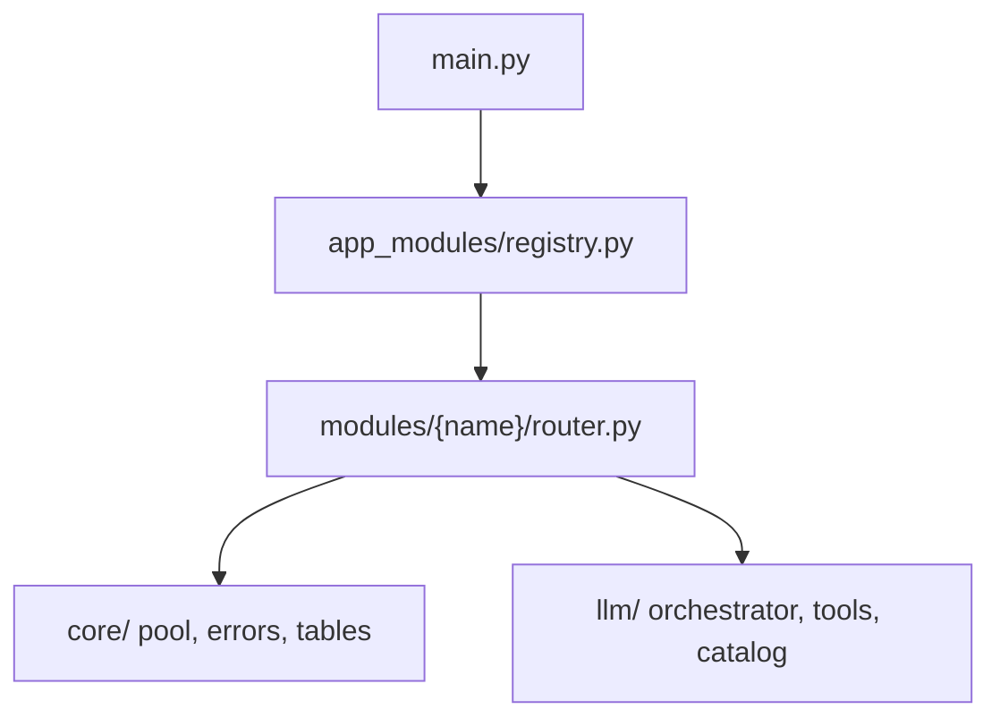

# Backend modules

Feature slices under `keel_api/src/modules/`. Each module owns HTTP routes, business logic, and SQL for one area of Keel.

## What a module is

A **module** is a vertical slice of the backend: `router.py` → `service.py` → `repository.py`, with Pydantic DTOs in `schemas.py` and route constants in `config.py`. Modules register via [`app_modules/registry.py`](../app_modules/registry.py); [`main.py`](../main.py) loops enabled entries — there is no auto-discovery.

| Type | Modules | Routes | Session | Frontend |
|------|---------|--------|---------|----------|
| **Feature** | projects, shop, contacts, focus, timeline | yes | yes | yes |
| **Orchestration** | chat | yes | yes | yes |
| **Catalog** | catalog, agents | yes | mostly | yes |
| **Infrastructure** | auth, settings, connectors, jobs | partial | partial | partial |
| **Utility** | home | yes | yes | yes |

## Modules

| Module | README | Purpose |
|--------|--------|---------|
| agents | [agents/README.md](./agents/README.md) | Agent catalog editing, system prompts, LLM prefs |
| auth | [auth/README.md](./auth/README.md) | Google OAuth, sessions, current user |
| catalog | [catalog/README.md](./catalog/README.md) | Intelligence catalog HTTP (models, tools, agents) |
| chat | [chat/README.md](./chat/README.md) | Conversations, messages, SSE streaming, chat rules |
| contacts | [contacts/README.md](./contacts/README.md) | Personal CRM, relationships, family trees |
| deleted | [deleted/README.md](./deleted/README.md) | Global recently-deleted trash snapshots and restore API |
| connectors | [connectors/README.md](./connectors/README.md) | External intelligence connectors (Focus automation adapter) |
| jobs | [jobs/README.md](./jobs/README.md) | Celery background workers, Beat schedules, job_runs tracking |
| focus | [focus/README.md](./focus/README.md) | Task/list nodes, tags, references, constellation |
| home | [home/README.md](./home/README.md) | Inspirational quotes for landing page |
| projects | [projects/README.md](./projects/README.md) | Baysic projects, workspace canvas, media |
| settings | [settings/README.md](./settings/README.md) | Per-user UI preferences JSON |
| finance | [finance/README.md](./finance/README.md) | Purchases, subscriptions, vendors, payment methods |
| timeline | [timeline/README.md](./timeline/README.md) | Life events with contact tagging |

## Standard root files

| File | Role |
|------|------|
| `__init__.py` | Package marker; optional one-line docstring |
| `config.py` | `FEATURE_KEY`, `ROUTE_PREFIX`, path constants, validation sets (not app env) |
| `router.py` | FastAPI routes; thin handlers delegating to `service` |
| `service.py` | Business logic, transactions, `AppError` |
| `repository.py` | Primary asyncpg SQL; table names from `core.tables` |
| `schemas.py` | Pydantic `*Public`, `*Create`, `*Update` models |

Not every module stops at six files. See **Extension patterns** below.

## Public API

Cross-module access uses documented public surfaces only. Other modules call **service** functions or HTTP — never **repository** layers or private helpers.

| Surface | Cross-module use |
|---------|------------------|
| `router.py` | Mounted by shell only ([`app_modules/registry.py`](../app_modules/registry.py)) |
| `service.py` or `service/__init__.py` | Public functions only — other modules import from the service barrel |
| `schemas.py` | DTO types when needed by native tools or other modules (prefer HTTP when possible) |
| Registry subpackages (e.g. `reference_registry/`) | Documented lookup surfaces — list exports in module README |
| `repository.py`, `*_repository.py` | **Private** — never import from another module |
| Internal helpers (`_helpers`, `_OBJECT_COLUMNS`, `service/helpers.py`) | **Private** |

**Allowed patterns:**

- Native tools in `llm/tools/native/` call public service functions or import create/update schemas.
- Feature modules use `modules.auth.service.get_current_user` for session context in routers.
- Cross-module reads that would cause circular imports may use direct SQL in a registry subpackage (see focus `reference_registry/`).

See [`.cursor/rules/module-import-boundaries.mdc`](../../../.cursor/rules/module-import-boundaries.mdc) and reference examples in [finance/README.md](./finance/README.md) and [focus/README.md](./focus/README.md).

## Extension patterns

| Pattern | When | Examples |
|---------|------|----------|
| `*_repository.py` | Multiple table groups | `focus/tags_repository.py`, `shop/merchant_repository.py` |
| `*_service.py` | Service split by subdomain | `contacts/families_service.py`, `contacts/tree_service.py` |
| `storage.py` | Filesystem media under env path | `catalog` only (via `llm/catalog/`) |
| Subpackage | Non-HTTP pipeline | `shop/listing/` (fetch + extract) |
| Registry module | Code-defined cross-module lookups | `focus/reference_registry/` |
| Task guide | Celery task registration workflow | `jobs/TASKS.md` |
| Helper module | Pure normalization | `projects/workspace_state.py` |
| Co-located tests | Unit tests beside service | `contacts/test_*_service.py` |

When a module deviates from the standard hex, expand the **Directory structure** tree to full depth and add an **Extended files and subsystems** table in that module's README.

## App integration



**Registration order in `app_modules/registry.py`:** auth → settings → deleted → catalog → media → chat → agents → projects → focus → connectors → contacts → home → finance → timeline → journal → jobs → coak → services → email.

**New module checklist:**

1. Create `keel_api/src/modules/{key}/` with router, service, repository, schemas, config (`FEATURE_KEY = "{key}"`)
2. Add `ModuleRegistration` entry in [`app_modules/registry.py`](../app_modules/registry.py)
3. Add table constants in [`core/tables.py`](../core/tables.py)
4. Add schema in [`scripts/db/init/001_schema.sql`](../../scripts/db/init/001_schema.sql) (and migration if production)
5. Optional: native tools under [`llm/tools/native/`](../llm/tools/native/) + catalog seed for tool categories
6. Module README + [`PROJECT_TREE.md`](../../PROJECT_TREE.md) in the same PR

## Relationship to `core/` and `llm/`

| Layer | Path | Role |
|-------|------|------|
| **core/** | [`../core/`](../core/) | App config, asyncpg pool, `AppError`, shared table name constants |
| **llm/** | [`../llm/`](../llm/) | Turn orchestration, providers, catalog cache, native tool executors |

HTTP modules call `core.database.get_pool()` and raise `core.errors.AppError`. Chat and agents orchestrate through `llm/`. Feature modules may expose **native tools** in `llm/tools/native/{folder}/` that call back into `modules.{name}.service`.

| Catalog category | Native folder | Backend module |
|------------------|---------------|----------------|
| `AGENDA` | `focus/` | focus |
| `HAUL` | `haul/` | shop |
| `PROJECTS` | `projects/` | projects |
| `CONTACTS` | `contacts/` | contacts |
| `OBSIDIAN`, `WEB`, `CORE` | matching folders | no HTTP module counterpart |

## File size and splitting

Keep module code files at roughly **500 lines or less**. See [`.cursor/rules/file-size-limit.mdc`](../../../.cursor/rules/file-size-limit.mdc).

When splitting:

- Extract `*_repository.py` or `*_service.py` by table or subdomain
- Create subpackages when a pipeline grows several files (`shop/listing/`)
- Group functions with `# -----` section headers per [code-section-grouping rule](../../../.cursor/rules/code-section-grouping.mdc)

## README vs PROJECT_TREE

| Doc | Purpose | Update when |
|-----|---------|-------------|
| **Module README** (`{module}/README.md`) | Architecture manifest — purpose, HTTP API, layers, extras | Routes, new subfolders, cross-module deps, LLM tools |
| **[PROJECT_TREE.md](../../PROJECT_TREE.md)** | Exhaustive per-file inventory under `src/modules/` and `llm/tools/native/` | Any new, renamed, or moved file |
| **This file** | Shared conventions | Module types or registration patterns change |

Update module READMEs in the **same PR** as structural code changes. See [`.cursor/rules/module-readme.mdc`](../../../.cursor/rules/module-readme.mdc).

## Module README template

Each module README follows this section order. **Optional** sections are omitted when N/A — do not leave empty placeholders.

1. **Title and one-line summary**
2. **Purpose** — 2–4 sentences
3. **Module type** — Feature, Orchestration, Catalog, Infrastructure, or Utility
4. **HTTP API** — prefix, auth, registration, endpoints table
5. **Public API** — router (shell), service exports, schemas, registry subpackages; note private layers
6. **Frontend integration** *(Optional)* — link to `keel_web/src/modules/{name}/README.md`
7. **Database** *(Optional)* — tables from `core/tables.py`
8. **Directory structure** — standard hex tree; expand for extras; optional folder conventions table
9. **Extended files and subsystems** *(when deviating)* — table per non-standard file/folder
10. **Layer responsibilities** — router / service / repository / schemas / config
11. **Key concepts and data flow** *(Optional)* — mermaid + bullets for complex modules
12. **LLM integration** *(Optional)* — native tools folder, catalog category, tool list
13. **Storage and environment** *(Optional)* — env var, limits from `config.py`
14. **Tests** *(Optional)* — co-located test files and how to run
15. **Dependencies** — other modules, `core/`, `llm/`
16. **Maintenance guidelines**
17. **Related documentation**
18. **Module changelog** — structural changes only (date + one line)

### Copy-paste skeleton

```markdown
# {ModuleName}

One-line summary.

## Purpose

...

## Module type

**{Type}** — ...

## HTTP API

**Prefix:** `/{feature}`  
**Auth:** ...  
**Registered in:** `keel_api/src/main.py` → ...

| Area | Endpoints |
|------|-----------|
| ... | ... |

## Public API

**Shell:** `router.py` — mounted via `app_modules/registry.py`.

**Service:** `modules.{name}.service` — list public functions here.

**Schemas:** DTOs other modules or tools may import — list explicitly.

**Private:** `repository.py`, internal helpers — do not import cross-module.

## Frontend integration

**Frontend counterpart:** [keel_web/src/modules/{name}/README.md](...)

## Database

| Table | Purpose |
|-------|---------|
| ... | ... |

## Directory structure

\```
{module}/
├── config.py
├── router.py
...
\```

## Extended files and subsystems

| Path | Role |
|------|------|
| ... | ... |

## Layer responsibilities

| Layer | Responsibility |
|-------|----------------|
| `router.py` | ... |

## Key concepts and data flow

...

## LLM integration

...

## Storage and environment

...

## Dependencies

...

## Maintenance guidelines

...

## Related documentation

- [Modules umbrella README](../README.md)
- [PROJECT_TREE.md](../../PROJECT_TREE.md)
- Frontend: `keel_web/src/modules/{name}/README.md`

## Module changelog

- **YYYY-MM-DD** — Initial module manifest.
```

## Reference-quality examples

After rollout, use these as templates for complexity level:

- **Standard hex:** [auth/README.md](./auth/README.md), [home/README.md](./home/README.md)
- **Extended layout:** [focus/README.md](./focus/README.md), [finance/README.md](./finance/README.md), [contacts/README.md](./contacts/README.md)
