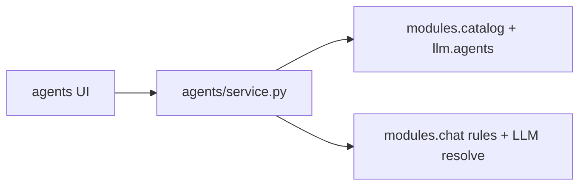

# Agents

Agent catalog editing, composed system prompts, context usage, and per-agent LLM preferences.

## Purpose

Agents exposes HTTP endpoints for browsing and editing catalog agents beyond read-only catalog lists. Users update agent metadata and tool category grants, preview composed system prompts, inspect estimated context/token usage, and set per-agent LLM provider/model overrides that fall back to global chat preferences when cleared.

## Module type

**Catalog** — DB-backed agent definitions plus editor surface; composes `llm/` and `modules.chat`.

## HTTP API

**Prefix:** `/agents`  
**Auth:** Session required on all routes.  
**Registered in:** `keel_api/src/main.py` → fifth router (`agents_router`).

| Area | Endpoints |
|------|-----------|
| Agents | `GET /agents`, `PATCH /agents/{agent_id}` |
| System prompt | `GET/PATCH /agents/{agent_id}/system-prompt` |
| Context | `GET /agents/{agent_id}/context-usage` |
| LLM prefs | `GET/PATCH/DELETE /agents/{agent_id}/preferences` |

## Frontend integration

**Frontend counterpart:** [keel_web/src/modules/agents/README.md](../../../../keel_web/src/modules/agents/README.md)

Agent gallery and editor use these routes; catalog lists also come from `/catalog/agents`.

## Database

| Table | Purpose |
|-------|---------|
| `agents` | Agent metadata (name, description, icon, etc.) |
| `agent_tool_categories` | Which tool categories an agent may invoke |
| `agent_delegations` | Delegation targets between agents |
| `agent_llm_preferences` | Per-agent provider/model override rows |
| `system_prompts` | DB-backed prompt sections composed into previews |

Global seed data; edits persist for all users (single-user deployment model).

## Directory structure

```
agents/
├── __init__.py
├── config.py       # Route path constants
├── router.py       # Agent editor routes
├── service.py      # Prompt preview, context usage, preference CRUD
├── repository.py   # agent_llm_preferences SQL
└── schemas.py      # Agent editor DTOs
```

## Layer responsibilities

| Layer | Responsibility |
|-------|----------------|
| `router.py` | Session-gated agent editor endpoints |
| `service.py` | Compose prompts, estimate tokens, merge catalog + chat rules |
| `repository.py` | Read/write per-agent LLM preference rows |
| `schemas.py` | Patch bodies and public response shapes |
| `config.py` | Path constants |

## Key concepts and data flow



- **Prompt preview** — merges DB prompt sections, chat rules, and tool manifest text for display.
- **Context usage** — token estimate for prompt + granted tools before starting a conversation.
- **Preferences** — `DELETE .../preferences` clears override so chat global prefs apply.

## LLM integration

Agents does not define native tool executors. It reads tool grants from catalog/agent_tool_categories and surfaces them in prompt preview and context usage via `llm.tools.manifest` and `llm.tools.assignments`.

## Dependencies

- **modules.catalog** — repository helpers, media URL prefix for agent icons
- **modules.chat** — `resolve_user_llm`, chat rules for prompt assembly
- **llm/** — agents registry, prompts registry, tokenization, tools manifest
- **core/** — pool, errors

## Maintenance guidelines

- Agent schema or tool category changes require catalog seed updates and reload.
- Keep prompt preview logic aligned with actual orchestrator system prompt assembly in `llm.orchestrator`.
- PATCH bodies should stay backward compatible for partial editor saves.

## Related documentation

- [Modules umbrella README](../README.md)
- [PROJECT_TREE.md](../../../PROJECT_TREE.md)
- Frontend: [keel_web/src/modules/agents/README.md](../../../../keel_web/src/modules/agents/README.md)
- Catalog HTTP: [catalog/README.md](../catalog/README.md)

## Module changelog

- **2026-06-15** — Initial module manifest.
