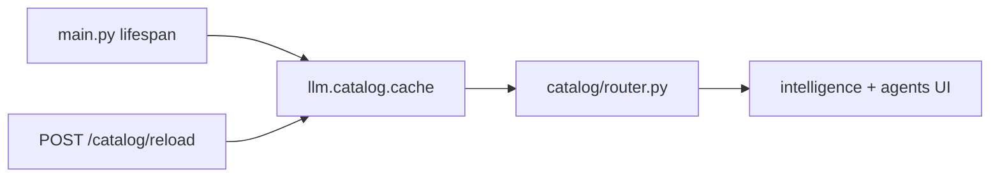

# Catalog

HTTP read surface for the intelligence catalog (models, tools, agents, prompts).

## Purpose

Catalog serves the in-memory cache built at startup from global seed tables. The intelligence and agents UI modules list providers, models, tool categories, tools, system prompts, and agents. A reload endpoint refreshes the cache from Postgres after catalog seed changes.

## Module type

**Catalog** — global seed data; mostly read-only HTTP; one unauthenticated media route.

## HTTP API

**Prefix:** `/catalog`  
**Auth:** Session required on all routes **except** `GET /catalog/media/{storage_key}` (public asset serving).  
**Registered in:** `keel_api/src/main.py` → third router (`catalog_router`).

| Area | Endpoints |
|------|-----------|
| Modalities | `GET /catalog/modalities` |
| Providers | `GET /catalog/providers` |
| Models | `GET /catalog/models` (optional `modality_key` filter) |
| Tools | `GET /catalog/tool-categories`, `GET /catalog/tools` |
| Prompts | `GET /catalog/system-prompts` |
| Agents | `GET /catalog/agents`, `GET /catalog/agents/{agent_id}` |
| Admin | `POST /catalog/reload` |
| Media | `GET /catalog/media/{storage_key}` *(no session)* |

## Frontend integration

**Frontend counterparts:**

- [keel_web/src/modules/catalog/README.md](../../../../keel_web/src/modules/catalog/README.md) — shared catalog API client
- [keel_web/src/modules/intelligence/README.md](../../../../keel_web/src/modules/intelligence/README.md) — models/tools browser
- [keel_web/src/modules/agents/README.md](../../../../keel_web/src/modules/agents/README.md) — agent editor (also uses `/agents` routes)

## Database

Global catalog tables (not per-user):

| Table | Purpose |
|-------|---------|
| `model_modalities`, `model_providers`, `models` | LLM provider catalog |
| `tool_categories`, `tools` | Native tool definitions and grouping |
| `system_prompts` | Prompt templates |
| `agents`, `agent_tool_categories`, `agent_delegations` | Agent definitions and grants |
| `catalog_media` | Asset metadata for catalog icons/images |

**Storage:** catalog asset files on disk via `llm/catalog/storage.py` (`CATALOG_ASSETS_PATH` env).

## Directory structure

```
catalog/
├── __init__.py
├── config.py       # ROUTE_PREFIX, path constants (no FEATURE_KEY)
├── router.py       # List endpoints + reload + media
├── service.py      # Reads llm.catalog.cache + formats responses
├── repository.py   # DB reload helpers when cache refresh needed
└── schemas.py      # Catalog DTOs
```

## Layer responsibilities

| Layer | Responsibility |
|-------|----------------|
| `router.py` | Session-gated lists; public media file response |
| `service.py` | Map in-memory catalog cache to API models |
| `repository.py` | Optional direct DB reads for reload path |
| `schemas.py` | Public catalog entity shapes |
| `config.py` | Route path constants only |

## Key concepts and data flow



- **Startup** — `load_catalog_cache()` in `main.py` before serving traffic.
- **Reload** — `POST /catalog/reload` re-reads seed tables and rebuilds tool/agent registries.
- **Media** — static files keyed by `storage_key`; served without auth for `` tags.

## Dependencies

- **llm/** — `llm.catalog.cache`, `llm.agents.registry`, `llm.tools.registry`, `llm.tools.assignments`
- **core/** — pool (reload path), errors
- **Not** — other HTTP modules (self-contained reads from `llm/`)

## Maintenance guidelines

- Catalog content changes require SQL updates in `scripts/db/init/002_catalog.sql` and often `POST /catalog/reload` or API restart.
- New tool categories need seed rows plus native tool files under `llm/tools/native/`.
- Keep public media route in mind for CORS/cache headers when adding asset types.

## Related documentation

- [Modules umbrella README](../README.md)
- [PROJECT_TREE.md](../../../PROJECT_TREE.md)
- Frontend: [keel_web/src/modules/catalog/README.md](../../../../keel_web/src/modules/catalog/README.md)

## Module changelog

- **2026-06-15** — Initial module manifest.
