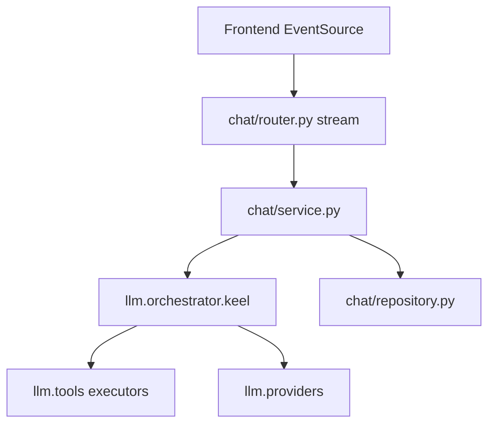

# Chat

Conversations, messages, SSE assistant streaming, LLM preferences, and chat rules.

## Purpose

Chat is Keel's messaging backend. Users create and manage conversation threads, send messages, and receive assistant replies via Server-Sent Events. The module resolves per-user LLM provider/model preferences, applies chat rules to prompts, and delegates turn handling to the LLM orchestrator with native tool execution.

## Module type

**Orchestration** — heavy `llm/` coupling; primary entry point for agent turns.

## HTTP API

**Prefix:** `/chat`  
**Auth:** Session required on all routes.  
**Registered in:** `keel_api/src/main.py` → fourth router (`chat_router`).

| Area | Endpoints |
|------|-----------|
| Conversations | `GET/POST /chat/conversations`, `GET/PATCH/DELETE /chat/conversations/{id}`, `PUT /chat/conversations/reorder` |
| Messages | `GET/POST /chat/conversations/{id}/messages`, `GET/PATCH/DELETE .../messages/{message_id}` |
| Streaming | `POST /chat/conversations/{id}/stream` — SSE assistant turn |
| LLM prefs | `GET/PATCH /chat/preferences`, `GET /chat/models` |
| Rules | `GET/POST /chat/rules`, `PATCH/DELETE /chat/rules/{rule_id}` |

**Notable config:** `DEFAULT_CONVERSATION_TITLE = "New conversation"`.

## Frontend integration

**Frontend counterpart:** [keel_web/src/modules/chat/README.md](../../../../keel_web/src/modules/chat/README.md)

TanStack Query + EventSource for conversation list, message history, and SSE streaming.

## Database

| Table | Purpose |
|-------|---------|
| `conversations` | Thread metadata; optional `project_id` link |
| `messages` | User and assistant turns |
| `tool_calls` | Persisted native tool invocations per message |
| `chat_rules` | User-defined rules injected into system context |
| `agent_llm_preferences` | Per-agent LLM overrides (also surfaced via agents module) |

All per-user except catalog-backed agent definitions referenced at runtime.

## Directory structure

```
chat/
├── __init__.py
├── config.py       # Conversation path constants, default title
├── router.py       # CRUD + SSE stream endpoint
├── service.py      # Turn orchestration, preference resolution
├── repository.py   # conversations, messages, tool_calls, rules SQL
└── schemas.py      # Conversation, message, rule, preference DTOs
```

## Layer responsibilities

| Layer | Responsibility |
|-------|----------------|
| `router.py` | CRUD routes; SSE response for stream endpoint |
| `service.py` | Message validation, calls `llm.orchestrator.keel.handle_turn`, resolves LLM prefs |
| `repository.py` | Conversation/message persistence, tool call logging |
| `schemas.py` | Request/response models for chat API |
| `config.py` | Route paths and defaults |

## Key concepts and data flow



- **Global vs project conversations** — `global_only` and `project_id` filters on list/create.
- **Stream endpoint** — `POST .../stream` emits SSE events for token deltas, tool calls, and completion.
- **LLM resolution** — user prefs from this module; per-agent overrides from `modules.agents` when an agent is selected.
- **Project link** — lazy import of `modules.projects` to validate `project_id` on conversation create/update.

## LLM integration

Chat does not define native tools. It **executes** tools granted to the active agent via `llm.tools.assignments` and `llm.tools.executors`. Tool definitions live in the catalog and `llm/tools/native/`.

## Dependencies

- **modules.auth** — `CurrentUserResponse` for streaming identity
- **modules.projects** — optional `project_id` validation on conversations
- **modules.agents** — agent selection and per-agent LLM prefs (read path)
- **llm/** — orchestrator, providers, models, SSE events, tool registry
- **core/** — pool, errors, table constants

## Maintenance guidelines

- `service.py` is a split candidate (~700+ lines) — extract turn helpers or rule assembly if growing further.
- SSE event shape changes require coordinated frontend chat module updates.
- New message fields need migration + schemas + repository sections.

## Related documentation

- [Modules umbrella README](../README.md)
- [PROJECT_TREE.md](../../../PROJECT_TREE.md)
- Frontend: [keel_web/src/modules/chat/README.md](../../../../keel_web/src/modules/chat/README.md)

## Module changelog

- **2026-06-15** — Initial module manifest.
