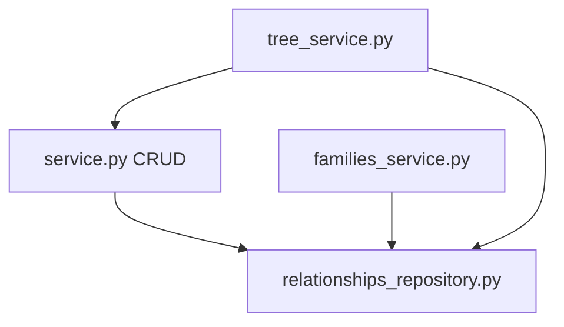

# Contacts

Personal CRM — contacts, relationships, profile photos, and computed family trees.

## Purpose

Contacts stores people records with optional profile photos (via unified Garage media), typed relationships between contacts, and genealogical graph logic for nuclear family groups and merged family trees. A special self-contact row is auto-created for the signed-in user. Family computation lives in dedicated service modules split from main CRUD orchestration.

## Module type

**Feature** — session auth, user-owned rows, frontend counterpart, native CONTACTS tools.

## HTTP API

**Prefix:** `/contacts`  
**Auth:** Session required on all routes.  
**Registered in:** `keel_api/src/main.py` → `contacts_router`.

| Area | Endpoints |
|------|-----------|
| Contacts | `GET/POST /contacts`, `GET/PATCH/DELETE /contacts/{contact_id}`, `GET /contacts/self` |
| Tags | `GET/POST /contacts/tags`, `PATCH/DELETE /contacts/tags/{tag_id}` |
| Relationships | `GET/POST /contacts/relationships`, `PATCH/DELETE .../relationships/{id}`, `GET /contacts/{contact_id}/relationships` |
| Families | `GET /contacts/family-groups`, `GET .../family-groups/{family_key}`, `GET .../{family_key}/tree`, `GET .../merged/tree` |

Profile photos use the unified **`/media`** API ([`modules/media/README.md`](../media/README.md)), not `/contacts/{id}/photo` routes.

## Media integration

| Role | Attachment | Notes |
|------|------------|-------|
| Profile photo | `media_attachments` with `entity_type = 'contact'`, `role = 'photo'` | One per contact; hydrated as `ContactPublic.photo` |

Upload via `POST /media`; attach via `POST /media/{media_id}/attachments`. List: `GET /media/by-entity/contact/{contact_id}`.

**Limits:** photo upload/MIME limits enforced by `modules/media`. Relationship and gender validation sets enforced in service layer.

**Write payloads:** `tag_ids` on contact create/update replaces all tag assignments (same semantics as timeline events).

## Frontend integration

**Frontend counterpart:** [keel_web/src/modules/people/README.md](../../../../keel_web/src/modules/people/README.md)

Contact list, detail editor, relationship manager, and family tree views call `/contacts` routes under the People module at `/people/contacts/*`. Photo upload/download uses **`/media`** (see frontend [people README](../../../../keel_web/src/modules/people/README.md)).

## Database

| Table | Purpose |
|-------|---------|
| `contacts` | Person records (name, dates, gender, notes); scoped by `user_id` |
| `contact_relationships` | Directed relationships between two contacts; scoped by `user_id` |
| `contact_tags` | User-owned colored labels |
| `contact_tag_assignments` | Many-to-many link between contacts and tags |

Contacts and relationships are per-user. Family groups and trees are computed from the authenticated user's contact graph. Referenced by focus `reference_registry` for record links (user-scoped).

## Directory structure

```
contacts/
├── __init__.py
├── config.py                    # Photo limits, relationship type sets
├── router.py                    # Contacts, relationships, families, tags
├── service.py                   # Contact/relationship CRUD; hydrates photo via modules.media
├── families_service.py          # Nuclear family group computation
├── tree_service.py              # Family tree subgraph building
├── repository.py                # contacts SQL
├── tags_repository.py           # contact_tags and assignments SQL
├── relationships_repository.py  # contact_relationships SQL
├── schemas.py                   # Contact, relationship, family DTOs
├── test_families_service.py     # Unit tests for families_service
└── test_tree_service.py         # Unit tests for tree_service
```

## Extended files and subsystems

| Path | Role |
|------|------|
| `families_service.py` | Derive nuclear family groups from relationship graph |
| `tree_service.py` | Build tree structures for one family or merged selection |
| `tags_repository.py` | Tag CRUD, contact assignment sync, tag hydration |
| `relationships_repository.py` | SQL isolated from main contact repository |
| `test_families_service.py` | Tests family grouping edge cases |
| `test_tree_service.py` | Tests tree layout and merge behavior |

## Layer responsibilities

| Layer | Responsibility |
|-------|----------------|
| `router.py` | Static paths before `/{contact_id}` |
| `service.py` | Contact CRUD, relationship validation, photo hydration via `modules.media`, delegates to family/tree services |
| `families_service.py` | Pure graph logic for family keys and group lists |
| `tree_service.py` | Tree node/edge assembly for API responses |
| `repository.py` | Contact row SQL including self-contact bootstrap |
| `relationships_repository.py` | Relationship CRUD SQL |
| `schemas.py` | Public models for contacts, relationships, families, trees |
| `config.py` | Validation frozensets and upload limits |

## Key concepts and data flow



- **Self contact** — `GET /contacts/self` returns or creates the user's own contact row.
- **Family keys** — stable identifiers for nuclear family units derived from parent/spouse/child relationships.
- **Merged tree** — `GET .../merged/tree?family_keys=...` combines multiple families for overlay display.
- **Genealogical types** — constrained relationship types (parent, child, spouse, etc.) in config validation sets.

## LLM integration

**Native tools folder:** `keel_api/src/llm/tools/native/contacts/`  
**Catalog category:** `CONTACTS`

| Tool file | Purpose |
|-----------|---------|
| `list_contacts.py` | List contacts with optional filters |
| `get_contact.py` | Get one contact by id |
| `search_contacts.py` | Search by name or other fields |
| `_contacts.py` | Shared tool helpers |

## Tests

Co-located unit tests (no top-level `tests/` package in keel_api):

```sh
cd keel_api
python -m pytest src/modules/contacts/test_families_service.py src/modules/contacts/test_tree_service.py
```

## Dependencies

- **modules.auth** — session user
- **modules.media** — profile photo attachment hydration
- **core/** — pool, errors, `CONTACTS`, `CONTACT_RELATIONSHIPS` table constants

## Maintenance guidelines

- Relationship type changes require config validation updates and frontend relationship picker sync.
- Family algorithm changes should extend co-located tests before shipping.
- Photo upload/attach behavior belongs in `modules/media`; contacts service only hydrates `ContactPublic.photo`.

## Related documentation

- [Modules umbrella README](../README.md)
- [PROJECT_TREE.md](../../../PROJECT_TREE.md)
- Frontend: [keel_web/src/modules/contacts/README.md](../../../../keel_web/src/modules/contacts/README.md)

## Module changelog

- **2026-07-11** — Per-user scoping for `contacts` and `contact_relationships`; migration `2026_07_09_contacts_user_scope`.
- **2026-07-02** — `birth_date_year_known` on contacts for month-and-day-only birth dates; migration `2026_07_02_contact_birth_date_year_known`.
- **2026-06-28** — README: remove stale `CONTACTS_MEDIA_PATH`, `storage.py`, and legacy `/contacts` photo routes; document unified `/media` attachments.
- **2026-06-27** — Contact label tags (`contact_tags`, assignments, CRUD API, `tag_ids` on contacts, list hydration).
- **2026-06-15** — Initial module manifest. Documented families/tree service split and co-located tests.
