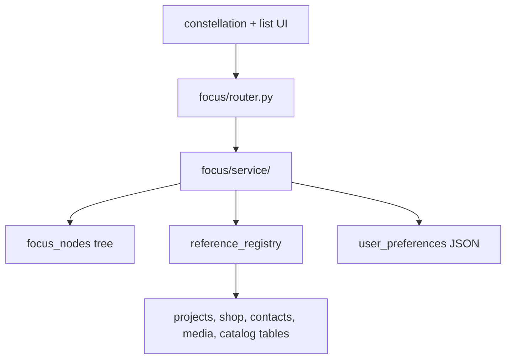

# Focus

Unified task/list node tree, tags, external references, and constellation layout persistence.

## Purpose

Focus is Keel's personal task system on the backend. A single `focus_nodes` tree holds items, nested lists, and linked external records. Users manage tags, search and inspect cross-module references (projects, shop items, contacts, agents, tools), and persist constellation graph layout and visual settings in user preferences JSON.

## Module type

**Feature** — session auth, user-owned rows, frontend counterpart, native AGENDA tools.

## HTTP API

**Prefix:** `/focus`  
**Auth:** Session required on all routes.  
**Registered in:** `keel_api/src/main.py` → `focus_router` (after projects).

| Area | Endpoints |
|------|-----------|
| Nodes | `GET/POST /focus/nodes`, `GET/PATCH/DELETE /focus/nodes/{id}`, `POST .../complete`, `POST /focus/nodes/reorder` |
| Node timers | `GET /focus/nodes/{id}/timer`, `POST .../timer/start`, `POST .../timer/pause`, `POST .../timer/resume`, `POST .../timer/end`, `GET .../time-entries` |
| References | `GET /focus/reference-types`, `GET /focus/references/search`, `GET /focus/references/detail`, `GET/PATCH /focus/reference-settings` |
| Constellation | `GET/PATCH /focus/constellation-state`, `GET/PATCH /focus/constellation-settings` |
| Tags | `GET/POST /focus/tags`, `PATCH/DELETE /focus/tags/{id}` |

**Notable config:** node kinds (`item`, `list`, `record`); statuses; `MAX_PARENT_DEPTH` = 64; constellation state version 6; visual enums (shape, canvas tone, connection style); preference key constants for settings JSON merge.

## Public API

| Surface | Cross-module use | Key symbols |
|---------|------------------|-------------|
| `router.py` | Shell only | All `/focus/*` routes — mounted via `app_modules/registry.py` |
| `service/__init__.py` | Connectors, native tools | Node CRUD (`create_focus_node`, `list_focus_nodes`, …), tag CRUD, timer lifecycle, reference search/detail, constellation state/settings |
| `reference_registry/` | Focus service + external lookups | `search_reference_targets`, `get_reference_detail`, `hydrate_reference_target`, `get_reference_type_meta`, `all_reference_type_metas` |
| `schemas.py` | Response/request DTOs | Node, tag, reference, constellation public models |
| `repository/` | **Private** | SQL only — never import cross-module |
| `service/helpers.py`, `service/_helpers` patterns | **Private** | Validation and mapping helpers |

**Known cross-module consumers:**

| Consumer | Imports |
|----------|---------|
| `modules/connectors` | Focus service for automation connector sessions |
| `llm/tools/native/focus/*` | Service functions for AGENDA tools |
| Other feature modules | Use HTTP or `reference_registry` — not focus repositories |

## Frontend integration

**Frontend counterpart:** [keel_web/src/modules/focus/README.md](../../../../keel_web/src/modules/focus/README.md)

v2 nodes API is primary; frontend `lists.ts` / `entries.ts` adapt legacy shapes. Constellation state/settings sync via dedicated endpoints.

## Database

| Table | Purpose |
|-------|---------|
| `focus_nodes` | Unified tree — items, lists, records with parent/child, status, notes, colors |
| `focus_node_time_entries` | Timer sessions for focus nodes; one open running/paused row per node |
| `focus_tags` | User-defined tags |
| `focus_node_tags` | Tag assignments on nodes |

Constellation layout and visual settings persist in `user_preferences.settings` JSON (via `modules.settings.repository`), not separate tables.

**Schema:** [`scripts/db/init/001_schema.sql`](../../../scripts/db/init/001_schema.sql) — includes `focus_node_time_entries` for node timer session persistence.

## Directory structure

```
focus/
├── __init__.py
├── config.py              # Kinds, statuses, constellation enums, path constants
├── router.py              # Nodes, references, constellation, tags
├── service/               # Business logic package (barrel: modules.focus.service)
│   ├── __init__.py        # Re-exports public service API
│   ├── helpers.py         # Validation, mapping, preference decode
│   ├── nodes.py           # Node tree CRUD and reorder
│   ├── tags.py            # Tag CRUD
│   ├── time_entries.py    # Node timer lifecycle actions
│   ├── references.py      # Reference search, detail, settings
│   ├── constellation_state.py    # Layout state in user prefs
│   ├── constellation_layout.py   # Layout snapshot + semantic placement for connector tools
│   ├── constellation_settings.py # Visual settings in user prefs
│   └── legacy.py          # LLM list/entry vocabulary adapters
├── repository/            # SQL repositories for Focus tables
│   ├── __init__.py
│   ├── nodes.py           # focus_nodes SQL
│   ├── tags.py            # focus_tags + focus_node_tags SQL
│   └── time_entries.py    # focus_node_time_entries SQL
├── reference_registry/    # Cross-module reference search and detail
│   ├── __init__.py        # Re-exports public registry API
│   ├── types.py           # Type metadata and manifests
│   ├── formatting.py      # Property value formatting
│   ├── search.py          # Picker search queries
│   ├── hydrate.py         # Load target summaries
│   └── detail.py          # Inspector property detail
└── schemas.py             # Node, tag, reference, constellation DTOs
```

## Extended files and subsystems

| Path | Role |
|------|------|
| `repository/` | SQL split by table group: nodes, tags, and node time entries |
| `reference_registry/` | Code-defined reference types (project, shop item, contact, agent, media object, tool, tool category); search queries across foreign tables; curated read-only detail for constellation property inspector |
| `service/` | Business logic split by feature — nodes, tags, timers, references, constellation prefs, legacy LLM adapters |

**reference_registry** reads DB tables directly (`projects`, `finance_transactions`, `contacts`, `media_objects`, catalog tables) without importing other modules' services — intentional to avoid circular imports and keep reference reads read-only.

## Layer responsibilities

| Layer | Responsibility |
|-------|----------------|
| `router.py` | Resource-grouped routes matching frontend areas |
| `service/` | Validation, tree invariants, calls settings repo for constellation JSON |
| `repository/nodes.py` | Node CRUD, reorder, subtree delete |
| `repository/tags.py` | Tag CRUD and node assignment |
| `repository/time_entries.py` | Timer history and lifecycle SQL |
| `reference_registry/` | Reference type registry, search, detail field curation |
| `schemas.py` | Public API models including constellation state/settings |
| `config.py` | Domain enums, limits, preference key names |

## Key concepts and data flow



- **Node kinds** — `item` (task), `list` (container), `record` (external link with `reference_type` + text `reference_id` so both numeric and UUID-backed targets are supported). Media object records may set `show_reference_content` so the constellation view renders linked media bytes instead of the node title.
- **Hub lists** — root lists with no parent; filter via `hub_lists_only` query param.
- **Constellation state** — node positions, expansion, viewport, notes panel position (versioned JSON).
- **Constellation settings** — visual prefs (node shape, edge style, sizes, config panel state).
- **Complete** — `POST .../complete` sets item status to completed in one operation.
- **Node timers** — `focus_node_time_entries` stores start/pause/resume/end sessions; ended rows remain immutable history, while a partial unique index allows only one open timer per node.

## LLM integration

**Native tools folder:** `keel_api/src/llm/tools/native/focus/`  
**Catalog category:** `AGENDA`

| Tool file | Purpose |
|-----------|---------|
| `list_focus_lists.py` | List root/nested lists |
| `get_focus_list.py` | Get one list with entries |
| `create_focus_list.py` / `update_focus_list.py` / `delete_focus_list.py` | List CRUD |
| `list_focus_entries.py` | List items in a list |
| `create_focus_entry.py` / `update_focus_entry.py` / `delete_focus_entry.py` | Item CRUD |
| `list_focus_tags.py` / `create_focus_tag.py` / `update_focus_tag.py` / `delete_focus_tag.py` | Tag CRUD |
| `_focus.py` | Shared helpers for tool executors |

Tools call `modules.focus.service` and `schemas` — they use list/entry-oriented shapes that map to the underlying node tree.

**External connector:** `modules/connectors/focus/` exposes `/connectors/focus/*` for outside LLMs via bearer-token tool invocation. It reuses this module's service layer and emits Focus automation SSE events for future constellation realtime UI. See [connectors/README.md](../connectors/README.md).

## Dependencies

- **modules.settings.repository** — persist constellation/reference preference JSON
- **modules.auth** — session user for all routes
- **core/** — pool, errors, `FOCUS_*` table constants
- **Read-only SQL across** — projects, shop, contacts, media, catalog tables (via reference_registry)

## Maintenance guidelines

- Add new service logic to the matching file under `service/` (or create a new file there if a feature area grows).
- Reference type additions require updates to `reference_registry/`, schemas, frontend picker, and property inspector.
- Constellation state version bumps need migration notes in module changelog and frontend compatibility handling.
- Update README + PROJECT_TREE when adding repositories or reference types.

## Related documentation

- [Modules umbrella README](../README.md)
- [PROJECT_TREE.md](../../../PROJECT_TREE.md)
- Frontend: [keel_web/src/modules/focus/README.md](../../../../keel_web/src/modules/focus/README.md)
- Schema: [`scripts/db/init/001_schema.sql`](../../../scripts/db/init/001_schema.sql)

## Module changelog

- **2026-07-12** — Added **Public API** section (modularity Phase 4).
- **2026-06-20** — Added `show_reference_content` on record nodes so Media object references can render embedded media in the constellation view; hydration now includes media preview metadata; consolidated production migration folder.
- **2026-06-20** — Added media object reference nodes and migrated Focus reference target IDs from integer to text for UUID-backed targets.
- **2026-06-19** — Added focus node timer persistence, timer endpoints, and split SQL repositories into `repository/`.
- **2026-06-18** — Documented external Focus connector adapter at `modules/connectors/focus/`.
- **2026-06-19** — Added `constellation_layout.py` for connector layout snapshot and semantic node placement.
- **2026-06-15** — Split `service.py` into `service/` package and `reference_registry.py` into `reference_registry/` package (file-size-limit).
- **2026-06-15** — Initial module manifest. Documented nodes API, reference_registry, tags_repository, constellation prefs in user settings.
