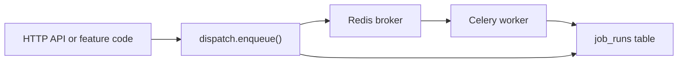

# Jobs tasks — add and update guide

How to register, schedule, and enqueue Celery tasks in Keel. Read this when adding a new background job or changing an existing one.

**Module overview:** [README.md](./README.md)

## Architecture at a glance



| Piece | File | Role |
|-------|------|------|
| Celery app | `celery_app.py` (shim) / `worker/app.py` | Broker config, autodiscover, `task_routes`, imports signals/runtime |
| Task constants | `config.py` | Stable task **names**, queue constants, `SCHEDULABLE_TASKS` allowlist |
| Task implementations | `tasks/*.py` | `@celery_app.task` functions workers execute |
| Worker registry | `worker/registry.py` | Maps task name → Celery task object (HTTP "Run now" lookup) |
| Enqueue helper | `dispatch.py` (shim) / `worker/dispatch.py` | Inserts `job_runs` row, publishes to Redis (`triggered_by=api\|manual`) |
| Lifecycle hooks | `worker/signals.py` | Updates `job_runs` on prerun/success/failure/retry |
| Async bridge | `runtime.py` (shim) / `worker/runtime.py` | `run_async()` + worker-scoped asyncpg pool |
| UI schedules | `job_schedules` table + HTTP API | Recurrence rules editable in the web UI; **Run now** enqueues immediately |

### Scheduling

Automatic firing of due schedule rows (DB-driven scheduler) is implemented via **`worker/beat_loader.py`**, which loads enabled `job_schedules` rows (including `interval` recurrence) into Celery Beat on startup and reloads when schedules change through the HTTP API (no Beat restart required).

The seeded `purge-expired-sessions-daily` row in migration `2026_07_01_job_schedules` replaces the former code-defined Beat entry.

### Execution paths

| Trigger | `triggered_by` | Who creates `job_runs` row |
|---------|----------------|----------------------------|
| `dispatch.enqueue()` from API/feature code | `api` | `dispatch.py` before publish |
| POST `/jobs/schedules/{id}/run` | `manual` | `dispatch.py` |

Task return values should be JSON-serializable dicts when possible — they are stored in `job_runs.result` and shown in the web UI.

## Queues

| Queue | Constant | When to use |
|-------|----------|-------------|
| `default` | `config.DEFAULT_QUEUE` | Fast SQL, small I/O |
| `heavy` | `config.HEAVY_QUEUE` | Backups, large bucket sync, Playwright, long external fetches |

Workers listen to both (`-Q default,heavy` in Docker Compose). Set queue on enqueue or on a `job_schedules` row.

Register new routes in `worker/app.py` → `task_routes` so Beat and direct publishes land on the right queue.

## Add a new task

Work through these steps in order. Skipping registry or `tasks/__init__.py` imports is the most common reason a task "does not exist" on the worker.

### 1. Add a task name constant

In `config.py`:

```python
TASK_MY_JOB = "jobs.tasks.my_module.run"
```

Use a dotted name under `jobs.tasks.*` — it is the stable Celery task name stored in `job_runs.task_name`.

Task modules import `celery_app` from `modules.jobs.worker.app` (not the root `celery_app.py` shim) to avoid a circular import during autodiscover.

### 2. Implement the task

Create `tasks/my_module.py` (or add to an existing file such as `maintenance.py`):

```python
from __future__ import annotations

import logging

from modules.jobs import config as jobs_config
from modules.jobs.worker.app import celery_app
from modules.jobs.runtime import run_async

logger = logging.getLogger(__name__)


async def _run_async(**kwargs: object) -> dict[str, object]:
    # Call repositories / other modules here. Worker has its own asyncpg pool.
    return {"ok": True}


@celery_app.task(name=jobs_config.TASK_MY_JOB, bind=True)
def run(self, **kwargs: object) -> dict[str, object]:
    del self  # bind=True gives access to self.request when needed
    return run_async(_run_async(**kwargs))
```

**Patterns:**

- **Sync-only work** (no DB): see `tasks/ping.py` — no `run_async` required.
- **Async DB / I/O**: put logic in an `async def` helper; call it via `run_async()` from the Celery entrypoint (see `tasks/maintenance.py`, `tasks/backup.py`).
- **Heavy helpers**: keep shared logic in a sibling module under `tasks/` (e.g. `tasks/backup_lib.py`) so the task file stays thin.
- **Cross-module calls**: import feature `repository` / `service` from the task helper; do not import FastAPI routers.

Prefer returning a small `dict` with counts or paths (`{"deleted_count": 42}`) for observability in the runs UI.

### 3. Register the import

In `tasks/__init__.py`, import the submodule so the worker loads it at startup:

```python
from modules.jobs.tasks import backup, maintenance, my_module, ping  # noqa: F401
```

`celery_app.autodiscover_tasks` relies on this package being importable.

### 4. Register in `worker/registry.py`

HTTP "Run now" and schedule validation resolve tasks through the registry:

```python
from modules.jobs.tasks.my_module import run as my_job_run

TASK_REGISTRY: dict[str, Task] = {
    ...
    jobs_config.TASK_MY_JOB: my_job_run,
}
```

### 5. Route to a queue (optional but recommended)

In `worker/app.py` → `task_routes`:

```python
jobs_config.TASK_MY_JOB: {"queue": jobs_config.DEFAULT_QUEUE},
```

Use `HEAVY_QUEUE` for long-running tasks.

### 6. Expose in the web UI (optional)

To let users pick the task when creating a schedule in `keel_web`, add a label to `SCHEDULABLE_TASKS` in `config.py`:

```python
SCHEDULABLE_TASKS: dict[str, str] = {
    ...
    jobs_config.TASK_MY_JOB: "Short label for UI",
}
```

Only tasks in this dict may be used in `POST/PATCH /jobs/schedules` or **Run now**. Tasks omitted here can still run via `dispatch.enqueue()`.

### 7. Expose in UI scheduler (optional)

Add a **`job_schedules`** seed in a migration or init SQL if you want a default row in the Schedules list (see the purge-sessions seed in `2026_07_01_job_schedules`). Users can edit recurrence in the UI and use **Run now** to enqueue.

### 8. Enqueue from feature code (optional)

From any async service handler:

```python
from modules.jobs.dispatch import enqueue
from modules.jobs.worker.registry import get_registered_task
from modules.jobs import config as jobs_config

task = get_registered_task(jobs_config.TASK_MY_JOB)
run_id = await enqueue(
    task,
    queue=jobs_config.DEFAULT_QUEUE,
    user_id=user.id,
    triggered_by="api",
    kwargs={"limit": 100},
)
```

`enqueue()` raises `503` when `JOBS_ENABLED=false`.

### 9. Update docs and verify

- Add the task to the **Registered tasks** table in [README.md](./README.md).
- Add a row to [PROJECT_TREE.md](../../../PROJECT_TREE.md) if you created a new file.
- Restart **worker** locally:

```sh
docker compose restart worker
```

Smoke-test:

```sh
docker compose exec api python scripts/dev/enqueue_ping.py   # existing ping script pattern
docker compose logs worker --tail 50
```

Confirm a row appears in `/jobs/runs` (or the web Runs tab) with status `success`.

## Update an existing task

| Change | Touch |
|--------|--------|
| Rename task (breaking) | `config.py` constant, `@celery_app.task(name=...)`, `worker/registry.py`, `SCHEDULABLE_TASKS`, any migrations/seeds referencing the old name, existing `job_schedules.task_name` rows |
| Change implementation only | Task module (`tasks/*.py` or helper lib); restart **worker** |
| Change default queue | `worker/app.py` `task_routes`, default on enqueue call sites |
| Add/remove UI scheduling | `SCHEDULABLE_TASKS` only |
| Accept new kwargs | Task signature + JSON-serializable values in `job_schedules.task_kwargs` or enqueue callers |

**Do not** change a published task name in place if production already has `job_runs` or schedules referencing it — add a new name and deprecate the old task.

### Task kwargs from UI schedules

Schedules store optional `task_kwargs` (JSON object). **Run now** passes them as Celery kwargs:

```python
@celery_app.task(name=jobs_config.TASK_MY_JOB, bind=True)
def run(self, *, days: int = 30, **_: object) -> dict[str, object]:
    ...
```

Keep kwargs JSON-serializable (str, int, float, bool, list, dict). Validate inside the task and raise clear errors for bad input.

## `job_runs` lifecycle

Workers do not update runs manually — `worker/signals.py` handles it:

1. **Prerun** — mark `running`.
2. **Success** — `status=success`, store `result` dict.
3. **Failure** — `status=failure`, store error message string.
4. **Retry** — `status=retry`.

If `JOBS_ENABLED=false`, signal handlers no-op (API enqueue is also blocked).

## Environment

| Variable | Effect |
|----------|--------|
| `JOBS_ENABLED` | When `false`, `dispatch.enqueue()` returns 503; signals skip DB updates |
| `REDIS_URL` | Celery broker |
| `CELERY_RESULT_BACKEND` | Result backend (runs are tracked in Postgres regardless) |
| `CELERY_WORKER_CONCURRENCY` | Parallel tasks per worker process |

See [keel_api/README.md](../../../README.md) for Docker Compose services (`worker`, `beat`, `redis`).

## Checklist (copy for PRs)

- [ ] `config.py` — `TASK_*` constant
- [ ] `tasks/<name>.py` — `@celery_app.task(name=...)`
- [ ] `tasks/__init__.py` — import new submodule
- [ ] `worker/registry.py` — registry entry
- [ ] `worker/app.py` — `task_routes` queue mapping
- [ ] `SCHEDULABLE_TASKS` — if schedulable in UI
- [ ] Feature enqueue call sites — if triggered from other modules
- [ ] [README.md](./README.md) registered tasks table
- [ ] Worker restarted / redeployed
- [ ] Manual or script smoke run verified in `job_runs`

## Related files (quick reference)

```
jobs/
├── config.py              # TASK_* names, SCHEDULABLE_TASKS, queues
├── celery_app.py          # Shim → worker.app (Docker entrypoint)
├── dispatch.py            # Shim → worker.dispatch.enqueue
├── runtime.py             # Shim → worker.runtime.run_async
├── repository/            # job_runs + job_schedules SQL
├── service/               # HTTP business logic
│   └── schedule_cron.py   # UI schedule summaries + next_run_at
├── worker/
│   ├── app.py             # Celery instance, task_routes, autodiscover
│   ├── registry.py        # name → Task for HTTP dispatch
│   ├── dispatch.py        # enqueue() implementation
│   ├── signals.py         # job_runs status sync
│   └── runtime.py         # run_async(), worker DB pool
└── tasks/
    ├── __init__.py        # import all task modules
    ├── backup_lib.py      # heavy helper example
    ├── ping.py            # minimal sync example
    ├── maintenance.py     # async + run_async example
    └── backup.py          # async + backup_lib example
```
