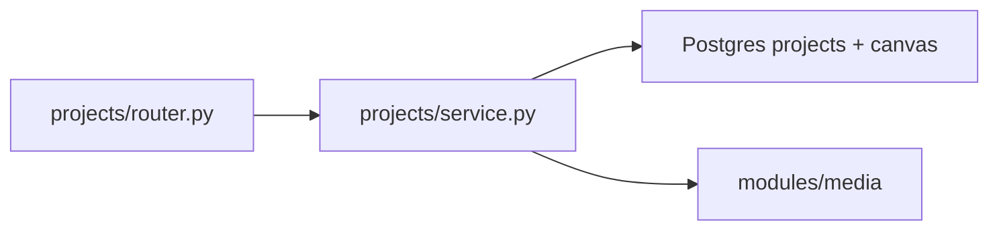

# Projects

Baysic personal projects with kanban statuses, tags, media, cover images, and workspace canvas.

## Purpose

Projects owns user project records with status workflow, tag assignments, cover/gallery media (via unified Garage storage), and a JSON workspace canvas (Obsidian-style nodes and edges). File bytes and attachment rows live in **`modules/media`** (`media_objects` + `media_attachments`); this module loads cover and gallery into `ProjectPublic` responses.

## Module type

**Feature** — session auth, user-owned rows, frontend counterpart, native PROJECTS tools.

## HTTP API

**Prefix:** `/projects`  
**Auth:** Session required on all routes.  
**Registered in:** `keel_api/src/main.py` → `projects_router`.

| Area | Endpoints |
|------|-----------|
| Tags | `GET/POST /projects/tags`, `PATCH/DELETE /projects/tags/{tag_id}` |
| Projects | `GET/POST /projects`, `GET/PATCH/DELETE /projects/{project_id}` |
| Folders | `GET/POST /projects/{project_id}/folders`, `PATCH/DELETE /projects/{project_id}/folders/{folder_id}` (`?all_folders=true` lists entire tree) |
| Workspace (default canvas) | `GET/PUT /projects/{project_id}/workspace`, `GET/PATCH /projects/{project_id}/workspace/settings` |
| Canvases | `GET/POST /projects/{project_id}/canvases`, `PATCH/DELETE /projects/{project_id}/canvases/{canvas_id}` |
| Canvas workspace | `GET/PUT /projects/{project_id}/canvases/{canvas_id}/workspace`, `GET/PATCH .../workspace/settings` |

## Frontend integration

**Frontend counterpart:** [keel_web/src/modules/projects/README.md](../../../../keel_web/src/modules/projects/README.md)

Gallery, detail editor, and workspace canvas call `/projects` routes for CRUD and workspace. Uploads, downloads, and gallery attachments use the unified **`/media`** API ([`modules/media/README.md`](../media/README.md)).

## Media integration

Cover and gallery files are **not** stored on project rows or served from `/projects` routes.

| Role | Attachment | Notes |
|------|------------|-------|
| Cover | `media_attachments` with `entity_type = 'project'`, `role = 'cover'` | One per project; hydrated as `ProjectPublic.cover` |
| Gallery | `media_attachments` with `role = 'gallery'` | Many per project; optional `project_folder_id` for nested folders |
| Bytes | `media_objects` in Garage (S3) | Upload via `POST /media`; attach via `POST /media/{media_id}/attachments` |

List attachments: `GET /media/by-entity/project/{project_id}`.

## Database

| Table | Purpose |
|-------|---------|
| `projects` | Project metadata, status, appearance fields |
| `project_tags` | Tag definitions |
| `project_tag_assignments` | Project ↔ tag links |
| `project_folders` | Nested folders for project gallery files (project module only) |
| `project_canvas` | Workspace JSON blob per project (`state` nodes/edges/viewport; `settings` UI prefs including note color style, preview map visibility, and grid dot strength) |

All per-user. Referenced by focus `reference_registry` for record links.

## Directory structure

```
projects/
├── __init__.py
├── config.py              # Status enums, upload limits, font keys
├── router.py              # Projects, tags, workspace, folders, canvases
├── service/               # Business logic
│   ├── __init__.py        # Barrel re-exports (service, folders_service, …)
│   ├── projects.py        # Project CRUD, tags, workspace canvas
│   ├── canvases.py        # Multi-canvas CRUD and default resolution
│   ├── folders.py         # Nested project folder CRUD
│   └── workspace_settings.py  # Workspace canvas UI settings parse/validate
├── repository/            # SQL access by table group
│   ├── __init__.py        # Barrel re-exports (repository, canvas_repository, …)
│   ├── projects.py        # projects SQL
│   ├── folders.py         # project_folders SQL
│   ├── canvas.py          # project_canvas SQL
│   └── tags.py            # project_tags + assignments SQL
├── workspace_state.py     # Canvas JSON parse/normalize helpers
└── schemas.py             # Project, tag, media, workspace DTOs
```

## Extended files and subsystems

| Path | Role |
|------|------|
| `service/projects.py` | Project CRUD, tags, workspace canvas orchestration |
| `service/folders.py` | Nested project folder CRUD and validation |
| `service/workspace_settings.py` | Parse/validate per-project workspace canvas UI settings JSON |
| `repository/canvas.py` | Load/replace workspace JSON in `project_canvas` |
| `repository/tags.py` | Tag definitions and assignment junction table |
| `repository/projects.py` | Core project row SQL |
| `repository/folders.py` | Nested project folder SQL |
| `workspace_state.py` | Pure helpers — normalize node/edge JSON before persist |

## Layer responsibilities

| Layer | Responsibility |
|-------|----------------|
| `router.py` | Static ordering (tags before `{project_id}`); no media upload routes |
| `service/` | Business logic — projects, folders, workspace settings; hydrates cover/gallery via `modules.media` |
| `repository/` | Split SQL by table group (`projects`, `folders`, `canvas`, `tags`) |
| `workspace_state.py` | Validation/normalization — no DB |
| `schemas.py` | Public models including workspace state shape |
| `config.py` | Limits, allowed MIME types, status/font constants |

## Key concepts and data flow



- **Workspace** — full replace via canvas-scoped `PUT .../canvases/{canvas_id}/workspace`; legacy `/workspace` targets default canvas.
- **Canvases** — many `project_canvas` rows per project; one `is_default` per project; lazy `"Main"` creation when missing.
- **Workspace settings** — stored per canvas in `project_canvas.settings`; includes canvas color, snap, preview map visibility, grid dot strength, config panel, text size, connection style, and note color style.
- **Cover / gallery** — loaded via `media_service.get_attachment_for_entity_role` and `list_gallery_for_entity`; clients upload and attach through `/media`.
- **Delete project** — project row cascade removes `media_attachments` links; unattached `media_objects` remain in the user's library until deleted via `/media`.
- **Chat link** — conversations may attach `project_id`; chat service validates project exists.

## LLM integration

**Native tools folder:** `keel_api/src/llm/tools/native/projects/`  
**Catalog category:** `PROJECTS`

| Tool file | Purpose |
|-----------|---------|
| `list_projects.py` / `get_project.py` / `create_project.py` / `update_project.py` / `delete_project.py` | Project CRUD |
| `list_project_tags.py` / `create_project_tag.py` / `update_project_tag.py` / `delete_project_tag.py` | Tag CRUD |
| `get_project_canvas.py` / `update_project_canvas.py` / `list_project_canvases.py` | Workspace read/write and canvas list |
| `list_project_media.py` | List project media attachments (unified `media_service`) |
| `set_project_cover.py` / `set_project_appearance.py` | Appearance updates |
| `_projects.py` | Shared tool helpers |

## Dependencies

- **modules.auth** — session user
- **modules.media** — cover/gallery hydration and workspace media-node validation
- **modules.chat** — validates `project_id` on conversation create/update (lazy import)
- **core/** — pool, errors, table constants

## Maintenance guidelines

- `service.py` (~1000 lines) — split upload vs workspace vs CRUD if growing further.
- Media type additions belong in `modules/media` (validation, MIME sets) plus frontend preview support.
- Workspace JSON schema changes require coordinated frontend `lib/workspace` updates.

## Related documentation

- [Modules umbrella README](../README.md)
- [PROJECT_TREE.md](../../../PROJECT_TREE.md)
- Frontend: [keel_web/src/modules/projects/README.md](../../../../keel_web/src/modules/projects/README.md)

## Module changelog

- **2026-06-28** — README: remove stale `PROJECTS_MEDIA_PATH` / `storage.py` docs; document unified `/media` attachments for cover and gallery.
- **2026-06-22** — Workspace canvas settings add optional `notes_grid_layout` for persisted notes grid tile placements per canvas.
- **2026-06-22** — Multi-canvas workspace: many `project_canvas` rows per project, canvas CRUD API, canvas-scoped workspace/settings routes, `list_project_canvases` LLM tool.

- **2026-07-05** — Project tag catalog API returns optional `description` and `project_count` (list endpoint).
- **2026-06-22** — Consolidated business logic under `service/` (`projects.py`, `folders.py`, `workspace_settings.py`).
- **2026-06-22** — Workspace settings include a persisted note color style value for frontend note-card color treatments.
- **2026-06-22** — Workspace settings include a persisted grid dot strength value for canvas dot prominence.
- **2026-06-22** — Workspace settings include a persisted preview map visibility toggle.
- **2026-06-22** — Consolidated SQL repositories under `repository/` (`projects.py`, `folders.py`, `canvas.py`, `tags.py`).
- **2026-06-22** — Per-project workspace canvas UI settings on `project_canvas.settings` with `GET/PATCH .../workspace/settings`.
- **2026-06-21** — Project-scoped nested folders (`project_folders`, attachment `project_folder_id`); folder CRUD routes under `/projects/{id}/folders`.
- **2026-06-15** — Initial module manifest. Documented split repositories, storage, workspace_state.
