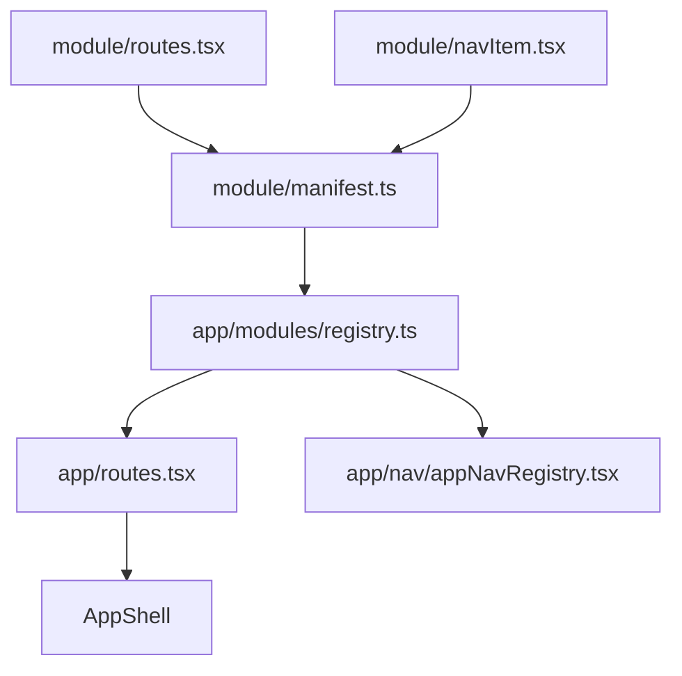

# Frontend modules

Feature slices and shared libraries under `keel_web/src/modules/`. Each module owns its routes, UI, hooks, and API client for one area of Keel.

**Shared view templates** live in [`../views/`](../views/) — list, form, and card gallery layouts. Modules import these instead of copying page chrome.

**Shared platform code** lives outside `modules/`:

| Layer | Path | Use for |
|-------|------|---------|
| **Components** | [`../components/`](../components/) | Reusable UI widgets (`CardMenu`, `ModuleTabBar`, `ListSearch`, …) |
| **Keel Persona** | [`../components/keelPersona/INTEGRATION.md`](../components/keelPersona/INTEGRATION.md) | Loading animations in feature modules (`KeelPersonaPlayer`) |
| **Hooks** | [`../hooks/`](../hooks/) | Cross-module React hooks (`useConfirmDeleteAction`, `usePageFileDrop`) |
| **Views** | [`../views/`](../views/) | Page layout templates (`ListPageLayout`, `FormPageLayout`, …) |

Feature modules must not import another module's `components/` or `hooks/` for generic UI — use the platform layer above.

## What a module is

A **module** is a vertical slice of the frontend: pages, components, hooks, and HTTP clients colocated by domain. Modules plug into the app shell — they do not import from each other’s internals unless there is an explicit, documented dependency (see individual module READMEs).

| Type | Examples | Routes | Nav | API |
|------|----------|--------|-----|-----|
| **Feature** | focus, projects, chat, finance | yes | usually | usually |
| **Cross-cutting** | auth | partial (login) | home icon only | yes |
| **Shared library** | catalog | no | no | yes (read-only) |
| **Shell-only** | home | yes (index) | via auth | optional |

## Modules

| Module | README | Purpose |
|--------|--------|---------|
| agents | [agents/README.md](./agents/README.md) | Agent catalog and editor |
| auth | [auth/README.md](./auth/README.md) | Session, login, route guards |
| catalog | [catalog/README.md](./catalog/README.md) | Shared intelligence catalog API |
| chat | [chat/README.md](./chat/README.md) | Conversations and SSE streaming |
| coak | [coak/README.md](./coak/README.md) | C.O.A.K. 3D knowledge graph experiment (frontend-only) |
| people | [people/README.md](./people/README.md) | Personal CRM (contacts), figures, and family tree |
| deleted | [deleted/README.md](./deleted/README.md) | Recently deleted trash list (Settings tab) |
| focus | [focus/README.md](./focus/README.md) | Tasks, lists, constellation graph |
| home | [home/README.md](./home/README.md) | Authenticated landing page |
| intelligence | [intelligence/README.md](./intelligence/README.md) | Models and tools browser |
| media | [media/README.md](./media/README.md) | Garage file storage list |
| projects | [projects/README.md](./projects/README.md) | Projects, kanban, workspace canvas |
| settings | [settings/README.md](./settings/README.md) | Theme, transitions, nav prefs |
| finance | [finance/README.md](./finance/README.md) | Transactions, subscriptions, vendors, accounts |
| timeline | [timeline/README.md](./timeline/README.md) | Life events, calendar views, contact and figure tagging |
| jobs | [jobs/README.md](./jobs/README.md) | Background job runs and recurring schedules |
| dev | [dev/README.md](./dev/README.md) | Dev-only front-end sandbox (not in production builds) |

## Standard root files

| File | Role |
|------|------|
| `manifest.ts` | Module registration — re-exports routes/nav for [`src/app/modules/registry.ts`](../app/modules/registry.ts) |
| `routes.tsx` | Route fragments referenced by `manifest.ts` (`shellRoutes` or `publicRoutes`) |
| `subNav.tsx` | Optional secondary tab definitions for modules with multiple top-level sections |
| `{Module}ModuleLayout.tsx` | Optional layout route wrapping `ModuleSubNavLayout` + nested pages |
| `navItem.tsx` | Optional nav entry referenced by `manifest.ts` |
| `api.ts` | HTTP client; may be a barrel re-exporting a split `api/` folder |

Not every module has every file. `catalog` has no routes or nav. `settings` has routes but no nav item (opened from profile menu). `home` has no navItem — the home icon lives in `auth/navItem.tsx`.

## Public exports

Modules register **upward** into the app shell. Cross-module imports must use documented public surfaces only — never another module's `components/`, `hooks/`, or `pages/`.

| Surface | Who may import | Examples |
|---------|----------------|----------|
| `manifest.ts` | App shell only (`src/app/**`) | [`app/modules/registry.ts`](../app/modules/registry.ts) |
| `api.ts` / `api/` | Any module or shell needing HTTP client + DTO types | `financeQueryKeys`, `MediaObject` type |
| `homeCards.ts`, `settingsTabs.ts` | Shell merge only (via manifest) | Not imported directly cross-module |
| Documented `lib/` exports | Callers listed in that module's README **Public exports** | `timelineCalendarEventTitle` for nav labels |
| `components/`, `hooks/`, `pages/` | **Same module only** | Use [`../components/`](../components/) / [`../hooks/`](../hooks/) for shared UI |
| `catalog` module | Shared library exception | Read-only catalog API |

**Allowed cross-module patterns:**

- Prefer HTTP between modules (call API, don't import UI).
- Shell imports from `api.ts` for breadcrumb/nav labels ([`buildNavigationLabelContext.ts`](../app/navigation/buildNavigationLabelContext.ts)).
- Hub modules (`media`, `auth`) may expose additional surfaces — list them in that module's README **Public exports**.
- When you need shared UI, extract to `src/components/` or `src/hooks/` (Phase 1 platform layer) rather than importing feature internals.

See [`.cursor/rules/module-import-boundaries.mdc`](../../.cursor/rules/module-import-boundaries.mdc) and reference examples in [finance/README.md](./finance/README.md) and [focus/README.md](./focus/README.md).

## Known boundary debt (Phase 4b)

Phase 1 removed the worst generic leaks. ~70 files still import another module's `components/` or `hooks/` — documented here for cleanup; ESLint enforcement is deferred until this list shrinks.

| Pattern | Importers | Likely fix |
|---------|-----------|------------|
| `projects/hooks/usePagePaste` | timeline, journal, media, finance | Extract to `src/hooks/usePagePaste.ts` |
| `projects/components/common/AutoSizeTextarea` | finance | Extract to `src/components/` |
| `media/components/pickers`, `EntityMediaCarousel`, `MediaPreview` | finance, journal, coak, home | Document as media hub exports or extract shared attachment UI |
| `focus/components/cards/card/*`, `focus/lib/appearance` | coak, focus←projects | Document focus public lib or extract card primitives |
| `chat/components/status`, `chat/lib/tools` | intelligence | Document chat public exports or extract to catalog/intelligence shared |
| `people/contacts/api`, `people/figures/api` | timeline, home, nav labels | Valid public API — document in timeline README |

**Shell exceptions (always allowed):** [`app/routes.tsx`](../app/routes.tsx) → `auth/components/RequireAuth`; [`buildNavigationLabelContext.ts`](../app/navigation/buildNavigationLabelContext.ts) → many `api.ts` + documented `lib/` display helpers.

## Standard subfolders

| Folder | Responsibility | Belongs here | Does not belong |
|--------|----------------|--------------|-----------------|
| `pages/` | Route-level shells | layout, query orchestration, view mode switching | reusable widgets, pure logic |
| `components/` | UI | JSX, local UI state | direct API calls (prefer hooks) |
| `hooks/` | Stateful React logic | effects, mutations, canvas state | pure functions |
| `lib/` | Pure TypeScript | mappers, geometry, constants, domain types | React imports |
| `context/` | React context providers | shared editor or panel state | fetch logic |
| `api/` | Split HTTP clients | fetch wrappers, DTO types, query keys | UI |

When a feature grows across several files, mirror the same subfolder name under `components/`, `hooks/`, and `lib/` (e.g. `constellation/`, `workspace/`).

## Shared view templates

Reusable page layouts in [`../views/`](../views/README.md):

| Template | Use for |
|----------|---------|
| `ListPageLayout` | List page header (title, count, subtitle, actions) |
| `ListView` | Sortable paginated tables — all data columns sort asc/desc |
| `TagsListView` | Tag manager tables |
| `FormPageLayout` | Create/edit form chrome (back link, save/discard) |
| `CardGalleryPageLayout` | Card grid galleries (Focus, Coak) |

Do not copy table shells or form headers into modules. Extend templates via slots (`headerSlot`, `afterHeader`, `persistHeaderAction`, etc.) — see the views README.

## App integration

**New module checklist:**

1. Create `keel_web/src/modules/{key}/` with pages, components, hooks, `api.ts`, `routes.tsx`, optional `navItem.tsx`, `subNav.tsx`
2. Add `manifest.ts` exporting `FeatureModuleManifest`
3. Register manifest in [`src/app/modules/registry.ts`](../app/modules/registry.ts)

**Nav registry order:** Home, Chat, Agents, Intelligence, Projects, Finance, Media, Contacts, Timeline, Journal, Jobs, Services, Email, Focus, Coak. Settings is not in the main nav.

## Module secondary navigation

Modules with multiple top-level sections can register a **secondary tab bar** below the app header:

1. Define tabs in `modules/{module}/subNav.tsx` as `ModuleSubNavItem[]` (see `app/nav/moduleSubNavConfig.ts`).
2. Add `{Module}ModuleLayout.tsx` that passes those items to `ModuleSubNavLayout`.
3. Nest module routes under the layout in `routes.tsx` (`<Route path="…" element={<ModuleLayout />}>` + child routes).

Shared UI lives in `app/nav/ModuleSubNav.tsx`. Last visited path per section is stored in localStorage (`moduleSubNavStorage.ts`) so switching tabs returns to the previous page in that section. Media is the reference implementation (`media/subNav.tsx`, `MediaModuleLayout.tsx`).

## File size and splitting

Keep module code files at roughly **500 lines or less**. See [`.cursor/rules/file-size-limit.mdc`](../../.cursor/rules/file-size-limit.mdc).

When splitting:

- Extract sub-components, hooks, helpers, types, or constants along cohesive seams
- Create subfolders when a concept grows several files
- Keep barrels (`api.ts`, `index.ts`) as re-exports so consumers do not churn

## README vs PROJECT_TREE

| Doc | Purpose | Update when |
|-----|---------|-------------|
| **Module README** (`{module}/README.md`) | Architecture manifest — purpose, routes, folder roles, concepts | Routes, API surface, new subfolders, cross-module deps |
| **[PROJECT_TREE.md](../PROJECT_TREE.md)** | Exhaustive per-file inventory | Any new, renamed, or moved file |
| **This file** | Shared conventions | Module types or integration patterns change |

Update module READMEs in the **same PR** as structural code changes. See [`.cursor/rules/module-readme.mdc`](../../.cursor/rules/module-readme.mdc).

## Module README template

Each module README follows the same section order:

1. Title and one-line summary
2. Purpose
3. Module type
4. Routes and navigation
5. Public exports
6. Backend integration
7. Directory structure (annotated tree + folder conventions table)
8. Key concepts and data flow (complex modules)
9. Dependencies
10. Maintenance guidelines
11. Related documentation
12. Module changelog (structural changes only)

See [finance/README.md](./finance/README.md) and [focus/README.md](./focus/README.md) for reference-quality **Public exports** examples; [projects/README.md](./projects/README.md) for directory structure depth.
