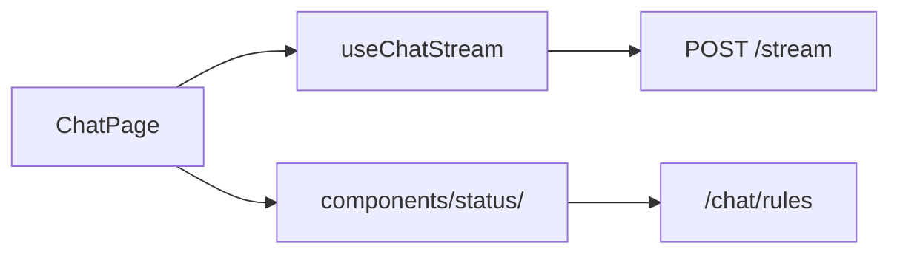

# Chat

Conversations with SSE streaming, model selection, rules, and dockable status panel.

## Purpose

Chat is Keel’s primary conversational interface. Users manage a reorderable conversation list, stream assistant turns over SSE, pick models and per-chat rules, and inspect tool calls and context usage in a dockable status panel. Shop listing proposals from the agent appear as confirmable cards in the message stream.

## Module type

**Feature** — routes, nav, and API.

## Routes and navigation

| Path | Page | Notes |
|------|------|-------|
| `/chat` | `ChatPage` | Full chat layout |

**Nav:** registered — id `chat`, title Chat, href `/chat`, accent blue.

**Registered in:** `manifest.ts` → [`app/modules/registry.ts`](../../app/modules/registry.ts).

**Auth:** shell route inside `RequireAuth` → `AppShell`.

## Backend integration

| Area | Endpoints |
|------|-----------|
| Conversations | `GET/POST /chat/conversations`, `PATCH/DELETE .../:id`, `PUT .../reorder` |
| Messages | `GET /chat/conversations/:id/messages` |
| Stream | `POST /chat/conversations/:id/stream` (SSE) |
| Models/prefs | `GET /chat/models`, `GET/PATCH /chat/preferences` |
| Rules | `GET/POST /chat/rules`, `PATCH/DELETE /chat/rules/:id` |

**Backend counterpart:** `keel_api/src/modules/chat/`

## Directory structure

```
chat/
├── api.ts
├── navItem.tsx
├── routes.tsx
├── components/
│   ├── common/         # AgentAvatar, SwitchToggle
│   ├── composer/       # ChatComposer
│   ├── conversation/   # List, reorder, agent picker
│   ├── message/        # MessageList, markdown, ProposalCard, RecordCard
│   ├── model/          # ModelSelect, ModelSettingsPanel
│   └── status/         # StatusPanel, Rules/Log/General tabs
├── hooks/              # useChatStream, status panel layout
├── lib/
│   ├── message/        # Metadata, display utils
│   ├── model/          # Model display helpers
│   ├── status/         # Panel registry, storage, drag, tab layout
│   └── tools/          # Tool category display
└── pages/
    └── ChatPage.tsx
```

## Key concepts and data flow



- **SSE streaming** — `useChatStream` drives live token/tool events; shared helpers in `lib/sse.ts` at app level.
- **Status panel** — floating, draggable panel with tab registry and persisted layout.
- **ProposalCard** — confirms or declines shop listing proposals extracted by the agent.

## Dependencies

- **agents** — avatars, catalog UI, agent picker
- **catalog** — model settings data
- **shop** — proposal confirm/decline API
- Platform **KeelPersonaPlayer** — empty-thread animation for Keel-driven conversations ([`INTEGRATION.md`](../../components/keelPersona/INTEGRATION.md))
- Consumed by **agents** (start chat, shared UI pieces)

## Maintenance guidelines

- Split status panel logic across `components/status/` (UI) and `lib/status/` (registry, storage).
- SSE and stream parsing stay in hooks — do not embed in message components.
- Update this README when adding stream event types, panel tabs, or rules API.

## Related documentation

- [Modules umbrella README](../README.md)
- [PROJECT_TREE.md](../../PROJECT_TREE.md)
- Backend: `keel_api/src/modules/chat/`

## Module changelog

- **2026-07-08** — Keel empty threads show a random Keel Persona animation (via `useRandomKeelClip`), quip, and a “send a message below” prompt in the history panel.
- **2026-06-15** — Initial module manifest.
