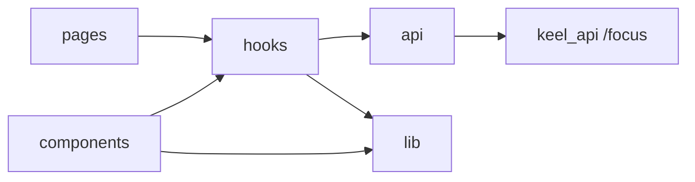

# Focus

Task and list management with card hub and constellation graph views.

## Purpose

Focus is Keel’s personal task and list system. Users browse root lists from a **cards** hub or an interactive **constellation** graph, drill into list editors, and manage tasks, nested lists, and linked external records. The module supports tagging, work orders, status workflows, and visual graph layout persisted per user.

## Module type

**Feature** — routes, nav, and API.

## Routes and navigation

| Path | Page | Notes |
|------|------|-------|
| `/focus` | `FocusHubRoute` | Hub: cards or constellation (localStorage toggle) |
| `/focus/lists/new` | `FocusFormPage` | Blank parent-less node form with Create action |
| `/focus/lists/:listId` | `FocusFormPage` | Full list editor |

**Nav:** registered — id `focus`, title Focus, href `/focus`, accent blue.

**Registered in:** `manifest.ts` → [`app/modules/registry.ts`](../../app/modules/registry.ts).

**Auth:** shell routes inside `RequireAuth` → `AppShell`.

## Public exports

| Surface | Exported for | Key symbols |
|---------|--------------|-------------|
| `manifest.ts` | App shell only | `focusManifest` |
| `api.ts` / `api/` | Cross-module HTTP client + types | `focusQueryKeys` (via `api/queryKeys.ts`); node/list/entry types and fetch helpers; tag, reference, constellation, automation, timer APIs |
| `lib/appearance.ts` | Documented cross-module *(coak, games)* | `FocusListCard` color/depth styling helpers — used by C.O.A.K. record cards and Games lobby cards |
| `lib/focus/referenceNavigation.ts` | Focus module + shell nav | Route resolution for linked external records |
| `components/`, `hooks/`, `pages/` | **Focus module only** | Constellation UI, form editors, hub pages — not imported cross-module |

**Documented imports from other modules (consumer side):**

| Module | Surface | Purpose |
|--------|---------|---------|
| `projects` | `lib/project/appearance.ts` | Title font styling on list cards *(boundary debt — Phase 4b)* |
| `media` | `api.ts`, `components/shared/MediaPreview` | Media object references in constellation nodes *(component import is boundary debt)* |
| Platform | `src/components/` | `CardMenu` on list cards |

**Shell consumers:** [`buildNavigationLabelContext.ts`](../../app/navigation/buildNavigationLabelContext.ts) imports `focusQueryKeys` and `FocusList` type from `api.ts`.

## Backend integration

**Client pattern:** `api.ts` barrel re-exports split modules under `api/`. All calls use `apiFetch` with session cookies. TanStack Query keys live in `api/queryKeys.ts` (base `["focus"]`).

**Primary API:** v2 **nodes** tree (`/focus/nodes`). `lists.ts` and `entries.ts` are legacy adapters mapping nodes ↔ list/entry shapes for existing UI.

| Area | Endpoints |
|------|-----------|
| Nodes | `GET/POST /focus/nodes`, `GET/PATCH/DELETE /focus/nodes/:id`, `POST .../complete`, `POST .../reorder` |
| Node timers | `GET /focus/nodes/:id/timer`, `POST .../timer/start`, `POST .../timer/pause`, `POST .../timer/resume`, `POST .../timer/end`, `GET .../time-entries` |
| Tags | `GET/POST /focus/tags`, `PATCH/DELETE /focus/tags/:id` |
| References | `GET /focus/reference-types`, `GET /focus/references/search`, `GET /focus/references/detail`, `GET/PATCH /focus/reference-settings` |
| Constellation | `GET/PATCH /focus/constellation-state`, `GET/PATCH /focus/constellation-settings` |
| Automation | `POST/GET/DELETE /connectors/focus/sessions`, `GET /connectors/focus/guide`, `GET /connectors/focus/events` (SSE) |

**External LLM connector:** constellation **Agent Mode** creates an ephemeral bearer token (sole auth credential for tool calls). Copy token or full setup instructions from the session modal. Backend guide: `keel_api/docs/connectors/focus-ai-connector.md`.

## Directory structure

```
focus/
├── api.ts              # Barrel — re-exports api/ modules
├── api/
│   ├── types.ts        # DTO types
│   ├── queryKeys.ts    # TanStack Query key factory
│   ├── mappers.ts      # Node ↔ list/entry mapping
│   ├── nodes.ts        # v2 node CRUD
│   ├── lists.ts        # Legacy list adapters
│   ├── entries.ts      # Legacy entry adapters
│   ├── timeEntries.ts  # Node timer state, history, start/pause/resume/end
│   ├── automation.ts   # External LLM connector sessions + guide
│   ├── tags.ts
│   ├── references.ts   # External record search
│   ├── constellation.ts
│   └── shared.ts
├── components/
│   ├── cards/          # Hub card grid
│   │   └── card/       # FocusListCard and visual sub-parts
│   ├── constellation/  # React Flow graph UI
│   │   ├── automation/ # Agent Mode controls, session modal, activity feed
│   │   ├── canvas/     # React Flow shell, canvas state wiring, save/status UI
│   │   ├── contextMenu/ # Right-click menus, icons, flyouts, menu hooks
│   │   ├── controls/   # Config panel, orbit, scope, and shape controls
│   │   ├── edge/       # Custom React Flow edge renderer
│   │   ├── modals/     # Node/list/task create and view modals
│   │   ├── node/       # Node renderer, badges, hover state, orbit handles
│   │   ├── notes/      # Draggable notes panel shell
│   │   └── references/ # External record inspector and reference badges
│   ├── forms/          # List and entry editor UI
│   │   ├── editors/    # List/item create/edit shells and headers
│   │   ├── entry/      # Entry add form, rows, inline title/notes, nested panel
│   │   ├── fields/     # Status, tag, and work-order inputs
│   │   ├── timer/      # Form-view timer controls and history panel
│   │   └── modals/     # Record picker modal
│   └── shared/         # Shared focus UI primitives
│       ├── hub/        # Hub chrome and header controls
│       ├── icons/      # Focus-specific icons
│       ├── references/ # Linked-record navigation links
│       └── tags/       # Tag manager and tag pill
├── hooks/
│   ├── useFocusBoard.ts, useFocusHubMutations.ts, useFocusListEditor*.ts, useFocusEntryDrag*.ts, useFocusNodeTimer.ts
│   ├── constellation/  # Canvas drag, edges, nodes, viewport, orbit, persistence
│   └── automation/     # LLM session, realtime SSE log, setup copy helpers
├── lib/
│   ├── appearance.ts   # Color/status display helpers
│   ├── focusEntryTree.ts # Staged form tree reorder/reparent helpers
│   ├── automation/     # Setup instruction builder, pan-to-node helpers
│   ├── focus.ts        # Barrel for lib/focus/
│   ├── constellation/  # Pure graph math, layout, animation, interaction
│   │   ├── graph/      # IDs, visibility, placement, layout indexes
│   │   └── settings/   # localStorage keys + constants
│   └── focus/          # Domain types, hub UI helpers, reference navigation
├── pages/
│   ├── FocusHubRoute.tsx       # View-mode switcher (cards | constellation)
│   ├── FocusCardsPage.tsx
│   ├── FocusConstellationPage.tsx
│   └── FocusFormPage.tsx
├── navItem.tsx
└── routes.tsx
```

### Folder conventions

| Folder | Responsibility | What belongs here | What does not belong |
|--------|----------------|-------------------|----------------------|
| `pages/` | Route shells | view-mode switching, page layout | reusable widgets, graph math |
| `components/cards/card/` | Card hub list cards | `FocusListCard` and its visual sub-parts | page-level hub controls |
| `components/constellation/canvas/` | Canvas shell | React Flow setup, canvas props/types, status/save chrome | node-specific rendering |
| `components/constellation/node/` | Node UI | node renderer, badges, hover state, node constants/types | pane menus, modals |
| `components/constellation/contextMenu/` | Graph menus | right-click menus, flyouts, menu icons, menu hooks | persistence or graph math |
| `components/constellation/automation/` | Agent Mode UI | session modal, mode button, activity overlay | connector HTTP/SSE hooks |
| `components/constellation/references/` | Reference UI | record inspector, reference type icon, inspector interaction context | reference API calls |
| `components/forms/` | List editor UI | editor shells, entry rows/forms, input fields, record picker | hub cards |
| `components/shared/` | Focus UI shared across views | hub chrome, tag UI, focus icons, tooltip primitive | graph-specific state |
| `hooks/constellation/` | Canvas state | drag, viewport, persistence effects | pure geometry |
| `lib/constellation/graph/` | Pure graph | layout, visibility, node IDs | React imports |
| `api/` | HTTP | fetch wrappers, mappers, query keys | UI |

## Key concepts and data flow



- **Hub view modes** — `cards` or `constellation`, persisted in localStorage (`keel.focus.hubViewMode`).
- **Nodes** — unified tree (`item`, `list`, `record` kinds) with parent/child, status, work order, colors.
- **Legacy adapters** — `lists.ts` / `entries.ts` translate nodes for list-centric UI without rewriting every screen.
- **Form dirty state** — list metadata, inline entry title/notes/status/work-order edits, and form-view entry drag moves share the form Save/Discard actions; route changes prompt before discarding unsaved edits. Drag moves can reorder across visible nested containers and are persisted as node `parent_id` / `sort_order` updates only on Save.
- **Form timers** — the list form header can start, pause, resume, and end a node timer; the optional right panel lists `focus_node_time_entries` history for that list node.
- **Constellation** — React Flow graph built from lists + entries; positions/expansion/viewport in `constellation-state`; visual prefs in `constellation-settings`. **Scoped view** filters the canvas to one list/record container subtree (ephemeral UI state in `FocusHubRoute`; same persisted layout keys).
- **Graph IDs** — synthetic IDs like `list:123` / `entry:456` in `lib/constellation/graph/ids.ts`.
- **References** — link entries to external records, including media objects, via searchable reference types; constellation record nodes expose a read-only property inspector from the border icon (`GET /focus/references/detail`). Media object record nodes can toggle **Show media content** in the selected node info panel to embed `MediaPreview` inside the node. Record node forms and the click-selected node info panel link to the referenced record's module form when a route exists.

## Dependencies

**Other frontend modules**

- `projects` — title font styling on list cards (`lib/project/appearance.ts`; Phase 4b: extract or document)
- `media` — media object references open `/media/:mediaId`; constellation nodes reuse `MediaPreview` for inline media content mode

**Shared app code**

- `src/components/` — `CardMenu` on list cards
- `lib/api.ts` — `apiFetch`
- `lib/listReorder.ts`, `components/list/` — drag-reorder UX
- `app/shell/AppShellContent` — page layout

**External libraries**

- `@tanstack/react-query` — data fetching and cache
- `@xyflow/react` — constellation canvas
- `react-router-dom` — routes and navigation

## Maintenance guidelines

- Split files past ~500 lines per [file-size-limit rule](../../../.cursor/rules/file-size-limit.mdc).
- Mirror feature names across layers: `components/constellation/`, `hooks/constellation/`, `lib/constellation/`.
- Keep `api.ts` as barrel when adding new `api/` files.
- Context menus stay UI-only under `components/constellation/contextMenu/`; persistence hooks live in `hooks/constellation/`.
- Update this README when adding routes, API resources, or new top-level subfolders; update [PROJECT_TREE.md](../../PROJECT_TREE.md) for every new file.

## Related documentation

- [Modules umbrella README](../README.md)
- [PROJECT_TREE.md](../../PROJECT_TREE.md)
- Backend: `keel_api/src/modules/focus/`

## Module changelog

- **2026-07-12** — Added **Public exports** section; updated Dependencies (platform `CardMenu`, Phase 4b boundary notes).
- **2026-06-20** — Media object constellation nodes support a **Show media content** toggle that embeds authenticated media previews inside the node.
- **2026-06-20** — Added Media object as a constellation record reference type with a Media badge and detail-page navigation.
- **2026-06-19** — Record reference links on list/record forms and the click-selected constellation node info panel (`FocusReferenceRecordLink`, `lib/focus/referenceNavigation.ts`).
- **2026-06-19** — Focus form polish: card-view blank node creation route, aligned entry row columns with item/list/record icons, eye navigation, inline notes editing, and unsaved-change guards.
- **2026-06-19** — Focus form tree drag: nested entry rows are draggable, cross-container moves are staged until Save, collapsed containers dwell-open during drag, and long lists auto-scroll near the edge.
- **2026-06-19** — Added form-view node timer controls, live elapsed display, and a time-entry history side panel backed by `/focus/nodes/:id/timer`.
- **2026-06-19** — Focus frontend components reorganized into intent-specific subfolders under `components/constellation/`, `cards/card/`, `forms/`, and `shared/`, with barrel exports for each new subfolder.
- **2026-06-19** — Scoped constellation view: subgraph filter from list/record containers, hub scope state in `FocusHubRoute`, context-menu icon + card button entry points, `lib/constellation/scope.ts` and `useFocusConstellationScopedGraph`.
- **2026-06-18** — Constellation LLM Mode UI: session toggle, token modal, automation log overlay, canvas lock, and pan-to-node from connector SSE events.
- **2026-06-19** — Edge-aware constellation child placement and connector-driven align/place handlers via automation SSE.
- **2026-06-17** — Constellation align children equalizes all child links to the longest current distance, animates children together, and moves collapsed descendants with their parent; drag persists hidden descendant offsets in stored positions.
- **2026-06-15** — Constellation node click path highlight: immediate origin-to-node lineage glow on edges and path nodes when a single node is selected.
- **2026-06-15** — Constellation notes panel: draggable screen-fixed shell with persisted `notes_panel_position`; shared placement for hover preview and selection editor (`FocusConstellationNotesPanelShell.tsx`, `useFocusConstellationDraggablePanel.ts`).
- **2026-06-15** — Constellation reference property inspector: click record border icon to browse curated fields via `GET /focus/references/detail`; added `FocusReferencePropertyInspector.tsx`.
- **2026-06-15** — Initial module manifest. Constellation subsystem split across `components/`, `hooks/`, and `lib/constellation/`; v2 nodes API with legacy list/entry adapters.
