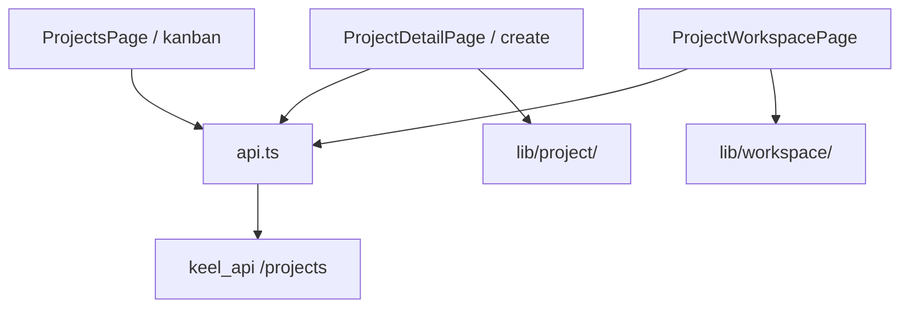

# Projects

Personal project tracker with kanban gallery, detail editing, media, and Obsidian-style workspace canvas.

## Purpose

Projects lets users organize work across statuses (planning through archived), edit rich project detail pages with covers and media, and open a per-project **workspace canvas** for notes and file nodes connected by labeled edges. The gallery supports grouped kanban or flat grid views with drag-to-change-status.

## Module type

**Feature** — routes, nav, and API.

## Routes and navigation

| Path | Page | Notes |
|------|------|-------|
| `/projects` | `ProjectsPage` | Kanban gallery |
| `/projects/tags` | `ProjectsTagsPage` | Tag catalog (search + list) |
| `/projects/new` | `ProjectCreatePage` | Create flow (reuses detail layout) |
| `/projects/:projectId/workspace` | `ProjectWorkspaceRedirect` | Redirects to default canvas |
| `/projects/:projectId/workspace/:canvasId` | `ProjectWorkspacePage` | Full-bleed canvas (route listed before `:projectId`) |
| `/projects/:projectId` | `ProjectDetailPage` | Detail/edit with draft-save |

**Nav:** registered — id `projects`, title Projects, href `/projects`, accent blue.

**Module sub-nav:** `ProjectsModuleLayout` renders secondary tabs (Projects, Tags) on gallery, detail, create, and tags routes via `subNav.tsx` + shared `ModuleSubNavLayout`. Workspace routes stay full-bleed outside the sub-nav layout.

**Registered in:** `manifest.ts` → [`app/modules/registry.ts`](../../app/modules/registry.ts).

**Auth:** shell routes inside `RequireAuth` → `AppShell`. Gallery, create, detail, and tags routes use `ProjectsModuleLayout` (`ModuleSubNavLayout` + `max-w-6xl`). Workspace routes stay full-bleed (no standard shell padding).

## Backend integration

**Client pattern:** single `api.ts` with TanStack Query keys (`projectsQueryKeys`). Session cookies on all calls. `normalizeProject()` applies appearance defaults on read. Media uploads use unified `/media` APIs (`uploadMedia`, `createMediaAttachment`, `deleteMediaAttachment`, `updateMediaFilename`); blobs fetched via authenticated media content URLs.

| Area | Endpoints |
|------|-----------|
| Projects | `GET/POST /projects`, `GET/PATCH/DELETE /projects/:id` |
| Workspace | `GET/PUT /projects/:id/canvases/:canvasId/workspace`, `GET/PATCH .../settings` |
| Canvases | `GET/POST /projects/:id/canvases`, `PATCH/DELETE /projects/:id/canvases/:canvasId` |
| Tags | `GET/POST /projects/tags`, `PATCH/DELETE /projects/tags/:tagId` |
| Media | `POST /media` upload, `POST /media/:id/attachments` attach (optional `project_folder_id`), `GET /media/by-entity/project/:id`, `DELETE /media/attachments/:id`, `PATCH /media/:id` rename |
| Folders | `GET/POST /projects/:id/folders`, `PATCH/DELETE /projects/:id/folders/:folderId` |
| Cover | Set via `createMediaAttachment` with `role: "cover"`; project JSON includes `cover: MediaPublic \| null` |

**Limits:** cover 10 MB, media 100 MB (mirrored frontend/backend).

**Backend counterpart:** `keel_api/src/modules/projects/` (router, service, repositories). DB: `projects`, `project_tags`, `project_tag_assignments`, `project_canvas`. Workspace settings include canvas color, snap, preview map visibility, grid dot strength, config panel, text size, connection style, note color style, and note italic color. Media in Garage via unified `media_objects` / `media_attachments`. LLM tools in `keel_api/src/llm/tools/native/projects/`.

## Directory structure

```
projects/
├── api.ts
├── navItem.tsx
├── ProjectsModuleLayout.tsx   # ModuleSubNavLayout wrapper
├── subNav.tsx                 # Projects · Tags tabs
├── routes.tsx
├── pages/
│   ├── ProjectsPage.tsx          # Kanban gallery
│   ├── ProjectsTagsPage.tsx      # Tag catalog
│   ├── ProjectCreatePage.tsx
│   ├── ProjectDetailPage.tsx
│   └── ProjectWorkspacePage.tsx  # Full-bleed canvas
├── hooks/
│   ├── useProjectTagCatalog.ts   # Tags subpage CRUD + search
│   ├── usePagePaste.ts           # Window-level paste file intake
│   ├── useWorkspaceAutosave.ts               # 800ms debounced canvas save
│   ├── useWorkspaceHistory.ts                # Undo stack
│   ├── useWorkspaceNoteBodyEditing.ts        # Note body draft, formatting toolbar, and context menu
│   ├── useWorkspaceNoteRefPicker.ts          # @ mention picker for note cross-references
│   ├── useWorkspaceNoteTextSelection.ts      # Text selection toolbar for note body editing
│   ├── useWorkspaceNotesGridEdgeProximity.ts   # Proximity tracking for shared notes grid resize edges
│   ├── useWorkspaceNotesGridResize.ts        # Elastic resize for notes grid overlay tiles
│   ├── useWorkspaceNotesGridSplitAdd.ts      # Split-add notes from tile edge hover in notes grid
│   ├── useWorkspaceNotesGridSwap.ts          # Two-step panel swap mode for notes grid overlay
│   └── useWorkspacePanelLayout.ts            # Side panel resize/position
├── components/
│   ├── card/           # Kanban cards, title, workspace shortcut
│   ├── common/         # Shared pickers, textareas, icons
│   ├── cover/          # Cover image, STL 3D, glow effects
│   ├── detail/         # Four-quadrant detail layout, inline editors
│   ├── kanban/         # Grouped board vs flat grid, status drag
│   ├── media/          # File section, upload cards, previews
│   ├── tags/           # Tag catalog list, pills, inline picker
│   └── workspace/      # React Flow canvas subsystem
│       ├── index.ts            # Page-level public exports
│       ├── canvas/             # React Flow shell, toolbar, snap, context menu
│       ├── context/            # Canvas + page-level React contexts
│       ├── edges/              # Custom edges, labels, edge toolbars
│       ├── nodes/              # Note/media node cards and shared node chrome
│       ├── panel/              # General/Files/Notes side panel and row UI
│       ├── settings/           # Floating config panel controls
│       └── overlays/           # Full-screen overlays (image lightbox, note reference modal, notes grid)
├── lib/
│   ├── project/
│   │   ├── projectStatus.ts, projectTagDisplay.ts, projectTagSearch.ts, projectCreatePreview.ts
│   │   ├── appearance/   # Cover glow, title fonts, image framing, drafts
│   │   ├── kanban/       # Group-by-status, pointer drag, localStorage pref
│   │   └── media/        # Upload validation, draft queue, object URLs
│   └── workspace/
│       ├── projectWorkspace.ts   # Core state types, parse/serialize
│       ├── canvas/               # Selection, clipboard, paste, drag
│       ├── edge/                 # Geometry, labels, normalization
│       ├── node/                 # Shapes, note colors, selection
│       ├── note/                 # Note cross-reference wiki-link syntax; notes grid layout and resize edges
│       ├── panel/                # Side panel + config panel storage
│       └── snap/                 # Box/hexagon snap threads
```

### Folder conventions

| Folder | Responsibility | What belongs here | What does not belong |
|--------|----------------|-------------------|----------------------|
| `components/detail/` | Detail page UI | inline editors, layout quadrants | canvas nodes |
| `components/workspace/` | Canvas UI | React Flow shell, nodes, edges, side panel, settings toggles | autosave logic (hooks) |
| `components/workspace/canvas/` | Canvas shell | React Flow host, toolbar, snap thread, context menu | node card internals |
| `components/workspace/context/` | Workspace contexts | Canvas + page-level React context providers | presentational UI |
| `components/workspace/edges/` | Edge UI | Custom edges, label editors, edge toolbars | edge geometry (lib) |
| `components/workspace/nodes/` | Node UI | Note/media cards, handles, resizers, toolbars | workspace state types |
| `components/workspace/panel/` | Side panel UI | Files/Notes tabs, list rows, drag preview | folder API logic (hooks) |
| `components/workspace/settings/` | Canvas settings UI | Config panel toggles, palettes, sliders | settings persistence (hooks/lib) |
| `components/workspace/overlays/` | Workspace overlays | Full-screen modal UI above the canvas | canvas nodes |
| `lib/project/` | Project entity | status, media drafts, appearance | canvas geometry |
| `lib/workspace/` | Canvas domain | state types, snap math, clipboard | React components |
| `pages/` | Route shells | draft-save orchestration, navigation state | reusable kanban pieces |

## Key concepts and data flow



- **Statuses** — `planning`, `active`, `paused`, `completed`, `archived` (`lib/project/projectStatus.ts`).
- **Draft-save model** — detail/create pages accumulate local edits; explicit Save/Create commits via mutations.
- **Kanban drag** — pointer drag detects `[data-kanban-status]` targets; optimistic status updates.
- **Workspace state** — `{ version, viewport, nodes, edges }` persisted to `project_canvas`; debounced autosave.
- **Workspace settings** — per-project canvas UI preferences include canvas color, snap, preview map visibility, grid dot strength, settings panel state, text scale, connection style, note color style, and note italic color (Markdown preview styling).
- **Node types** — `WorkspaceNoteNode` (Markdown text, color, shape) and `WorkspaceMediaNode` (linked Garage media UUIDs). The workspace side panel exposes General, Files, and Notes tabs; General edits project title/status/tags/title font, while Notes reflects live canvas note cards with color-matched borders and can focus, rename, delete, or add notes without extra storage.
- **Note cross-references** — note bodies can link to other note cards inline via `[[note-<uuid>]]` wiki-link tokens (inserted with `@` while editing). Preview mode renders links as color-matched tag pills; clicking a pill opens a full-screen editable modal for the referenced note (backdrop click or Escape closes).
- **Note body editing** — while editing a note body, highlighting text opens a floating toolbar (color palette, bold, italic, strikethrough) and an Actions dropdown. Create note spawns a linked note card to the right and replaces the selection with a wiki-link pill. Right-click offers Add separator and Add checkbox. In preview mode, GFM task-list checkboxes toggle on click without entering edit mode.
- **Notes grid overlay** — canvas toolbar **Grid** opens a full-window packed grid of note cards with elastic edge resize, tile-edge split-add (hover plus), Swap via right-click, preview-mode checkbox toggling, and body-editing context menu parity with canvas notes. Layout persists per canvas in workspace settings.
- **Note color style** — workspace-wide setting changes how each note displays its stored color (Filled, Soft, Outline, Bold) without changing the note color value.
- **Covers** — images with pan/scale framing; 3D models via shared `lib/stl-viewer` (Three.js).
- **View media** — project file card menus link to `/media/:id`; menus are portaled to avoid card overflow clipping.

## Dependencies

**Other frontend modules**

- Consumed by **focus** — title font styling, `ProjectDetailInlineTitle`
- Consumed by **home**, **settings** — title font key types

**Shared app code**

- `lib/api.ts`, `lib/stl-viewer/` — HTTP and 3D preview
- `components/panels/` — resize/reposition grips for workspace side panel
- `app/navigation/` — workspace page navigation stack restore

**External libraries**

- `@tanstack/react-query`, `@xyflow/react`, `framer-motion`, `react-router-dom`

## Maintenance guidelines

- Keep `lib/project/` for entity/kanban/media/tags; `lib/workspace/` for canvas-only logic.
- Workspace route must stay **before** `:projectId` in `routes.tsx`.
- New canvas features: add UI under `components/workspace/{canvas|nodes|edges|panel|settings|overlays}/`, state/helpers under `lib/workspace/{area}/`.
- Update this README when adding routes, API resources, or workspace node types; update [PROJECT_TREE.md](../../PROJECT_TREE.md) for every new file.

## Related documentation

- [Modules umbrella README](../README.md)
- [PROJECT_TREE.md](../../PROJECT_TREE.md)
- Backend: `keel_api/src/modules/projects/`

## Module changelog

- **2026-07-09** — `usePageFileDrop` moved to `src/hooks/` (shared with finance, journal, timeline, media).
- **2026-07-05** — Tags sub-nav page (`/projects/tags`) with Shop/Timeline-style searchable catalog; removed card-view tag manager popup.
- **2026-07-01** — Gallery, create, and detail routes share `ProjectsStandardLayout` (`max-w-6xl` content column); workspace routes remain full-bleed.
- **2026-06-22** — Dead-code cleanup: removed orphaned components (`ProjectDetailIcon`, `ProjectTagSelect`, `ProjectCoverEdgeFade`), unused exports/helpers, and legacy migration shims (browser `localStorage` workspace-settings migration, legacy note fill-color mapping, legacy edge stroke stripping); kept label-anchor defensive filtering on canvas load.
- **2026-06-22** — Notes grid overlay adds tile-edge hover split-add, preview checkbox toggling, body-editing context menu routing, and resize overlap fixes.
- **2026-06-22** — Notes grid overlay adds right-click **Swap** to exchange two tile positions and sizes without rearranging the grid.
- **2026-06-22** — Notes grid auto-fit runs only on first open; manual layouts persist on reopen and tiles may scroll when content overflows.
- **2026-06-22** — Notes grid overlay keeps the panel fully packed (no empty gaps) after resize or swap.
- **2026-06-22** — Notes grid resize bars are thicker, theme-glow on hover, and row-height (horizontal) boundaries target correctly across all columns.
- **2026-06-22** — Notes grid overlay uses shared proximity-revealed edge bars (canvas theme color) instead of per-tile corner resize handles.
- **2026-06-22** — Canvas toolbar **Grid** opens a full-window packed notes grid with hover-only resize handles; layout persists in canvas workspace settings after resize.
- **2026-06-22** — Multi-canvas workspace: Canvases side-panel tab, URL `/projects/:projectId/workspace/:canvasId`, per-canvas state/settings/autosave.

- **Files section** — nested project folders (drill-in breadcrumb), Add menu (upload / select from media / create folder), draft-first folder and media-library selections until Save.
- **2026-06-22** — Workspace note body editing shows a floating selection toolbar (formatting + Create note action) and a scalable right-click action menu while editing.
- **2026-06-22** — Workspace note cards support `@` mentions and clickable cross-note references (wiki-link tokens, tag pills, editable reference modal).
- **2026-06-22** — Workspace settings panel adds an Italic color palette (seven presets) for Markdown italic text in note card preview; italic text renders at 50% of the title size.
- **2026-06-22** — Workspace settings panel adds a Grid dots slider for tuning canvas dot prominence per project.
- **2026-06-22** — Workspace side panel adds a first General tab for project title, title font, status, and tags; the workspace page no longer shows a separate project-name header.
- **2026-06-22** — Workspace settings panel adds a Preview toggle for showing or hiding the bottom-right canvas minimap per project.
- **2026-06-22** — Split `components/workspace/` into subfolders (`canvas/`, `context/`, `edges/`, `nodes/`, `panel/`, `settings/`, `overlays/`) with a root barrel export for page-level imports.
- **2026-06-22** — Note reference modal animates open from the clicked tag pill and collapses back into it on dismiss.
- **2026-06-22** — Workspace note toolbar adds two-step delete; body editing right-click inserts markdown separators instead of showing delete.
- **2026-06-22** — Workspace side panel adds Files/Notes tabs; Notes lists live canvas note cards with color-matched borders, focus glow, inline rename, delete, and plus-to-add behavior while sharing the compact row styling.
- **2026-06-22** — Workspace settings add a note color style toggle (Filled, Soft, Outline, Bold) that changes note-card color treatment globally without changing individual note colors.
- **2026-06-22** — Workspace note cards render body text as GitHub-flavored Markdown in canvas view while keeping inline Markdown editing.
- **2026-06-22** — Per-project workspace canvas settings (color, snap, config panel) persist via API; `useProjectWorkspaceSettings` with legacy `localStorage` migration.
- **2026-06-22** — Workspace settings panel adds text size slider and connection style toggle; edges use directional gradient strokes (source → target).
- **2026-06-21** — Canvas connection handles appear on card hover (no selection required); handles render above note drag surfaces.
- **2026-06-21** — Canvas-focused paste uploads files to media and the project Files panel without a dialog, then places media nodes at the cursor.
- **2026-06-21** — Project file folders, attach-from-media multi-select, and extended Add file menu on detail view.
- **2026-06-21** — Files section header stays consistent at all folder depths; drag-and-drop moves (draft until Save) with Media-module-style previews and folder hover-open.
- **2026-06-20** — Project files and workspace media use unified `/media` attachments (Garage UUIDs); file card **View media**; portaled card menus; compact plus button on gallery header.
- **2026-06-15** — Initial module manifest. Workspace canvas split across `components/workspace/` and `lib/workspace/` (canvas, edge, node, panel, snap).
