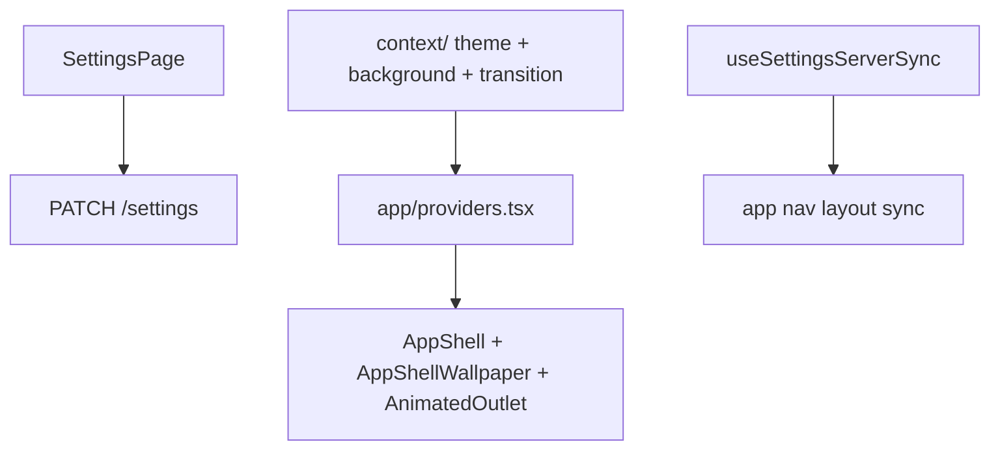

# Settings

User preferences — theme, optional shell wallpaper, page transitions, nav layout, breadcrumb trail length, profile name and picture, and home display options.

## Purpose

Settings is the preferences surface opened from the profile menu (not main nav). Users edit display name, profile picture, theme, shell wallpaper, shell page transitions, nav panel layout sync, breadcrumb trail length, and home greeting font. Quote rotation interval is edited on the home quote card. Theme, background, and transition contexts wrap the entire app via `app/providers.tsx`.

## Module type

**Feature** — routes only (no nav item); global side effects via React contexts.

## Routes and navigation

| Path | Page | Notes |
|------|------|-------|
| `/settings` | `SettingsPage` | Tabbed settings (General, Home Cards, Themes, Animations, Recently Deleted) |

**Nav:** none — opened from `auth/ProfileMenu`.

**Registered in:** `manifest.ts` → [`app/modules/registry.ts`](../../app/modules/registry.ts).

**Auth:** shell route inside `RequireAuth` → `AppShell`.

## Backend integration

| Endpoints | Purpose |
|-----------|---------|
| `GET/PATCH /settings` | Persisted prefs blob |
| `PATCH /auth/me` | Profile display name and `picture_url` |

Stored fields include: `nav_menu_layout`, `nav_menu_visibility`, `nav_wave_glow_enabled`, `nav_breadcrumb_max_entries`, `nav_panel`, `theme`, `shell_background`, `transitions`, `home_greeting_font_key`, `home_greeting_font_size_px`, `home_quote_interval_seconds`, `home_slideshow`, `home_card_layout`, `home_card_visibility`.

**`nav_menu_visibility`** — `{ [navItemId]: false }` for hidden nav menu items; omitted keys are visible. Hidden items keep their slot in `nav_menu_layout`. Hide/unhide from the nav panel context menu.

**Backend counterpart:** `keel_api/src/modules/settings/`

## Directory structure

```
settings/
├── api.ts
├── routes.tsx
├── settingsTabs.ts     # core settings tab manifest contributions
├── components/
│   ├── GeneralSettingsTabPanel, GeneralSettingsTab, HomeCardsSettingsTab, ThemesSettingsTab, AnimationsSettingsTab, AnimationViewToggle, KeelAnimationCarouselView, KeelAnimationSettingsCard, BackgroundSettingsSection, BreadcrumbSettingsSection, NavWaveGlowSettingsSection, ProfileNameSection, ProfilePictureField
│   ├── settingsTabRegistry.tsx, SettingsPageTabs
│   └── context/    # ThemeSettingsContext, BackgroundSettingsContext, TransitionSettingsContext
├── hooks/          # useSettingsServerSync (shell ↔ server sync)
├── lib/
│   ├── config/     # settingsTabsConfig
│   ├── animationView.ts  # Animations tab cards/carousel view preference
│   ├── background/ # shellBackgroundSettings
│   ├── theme/      # themeSettings
│   └── transition/ # transitionSettings
└── pages/
    └── SettingsPage.tsx
```

## Key concepts and data flow



- **App-wide contexts** — theme, shell background, and transition contexts are consumed outside this module.
- **Nav sync** — `useSettingsServerSync` keeps nav order/panel state aligned with server after login.
- **Themes** — nine visual themes (`forest`, `ember`, `sage`, `parchment`, `midnight`, `obsidian`, `sepia`, `signal`, `rainy_night`) defined in `lib/theme/themeSettings.ts` and `src/styles/themes.css`. `rainy_night` is the first dynamic theme (layered falling rain via `AppThemeEffects`). Legacy IDs (`theme-one` … `theme-four`) migrate automatically via `resolveThemeId()`. CSS variables drive colors, radius, shadows, chrome, and accent tokens consumed by Tailwind (`accent`, `rounded-app-*`, `shadow-app-*`) and utility classes in `index.css`.

## Dependencies

- **auth/api** — profile name and picture (`PATCH /auth/me`)
- **agents** — `EditableText` for inline name edit
- **projects** — title font key types for home greeting
- **lib/keelPersona**, **components/keelPersona** — Animations tab gallery (`listKeelClips`, `KeelPersonaPlayer`)
- Consumed by **app** (providers, nav), **home**

## Maintenance guidelines

- Global preference keys: add to backend schema, `api.ts` types, and General/Themes tab UI together.
- Context providers must stay compatible with `app/providers.tsx` — document breaking changes here.

## Related documentation

- [Modules umbrella README](../README.md)
- [PROJECT_TREE.md](../../PROJECT_TREE.md)
- Backend: `keel_api/src/modules/settings/`

## Module changelog

- **2026-07-09** — Animations tab view toggle (card grid or horizontal focus carousel); preference stored in `keel.settings.animations.viewMode`.
- **2026-07-09** — `nav_menu_visibility` preference for nav panel hide/unhide via context menu (hidden items keep `nav_menu_layout` order).
- **2026-07-08** — General tab nav menu wave glow toggle (`nav_wave_glow_enabled`, default on).
- **2026-07-08** — **Animations** settings tab — evenly-sized card grid of registered Keel Persona clips with live looping previews and quip text.
- **2026-07-11** — Phase 3 registry decentralization: core tabs export via `settingsTabs.ts` + manifest; `settingsTabRegistry.tsx` merges enabled manifest contributions; deleted module owns Recently Deleted tab.
- **2026-07-05** — General tab profile picture picker (`ProfilePictureField`); updates `users.picture_url` via `PATCH /auth/me`.
- **2026-07-05** — General tab breadcrumb trail length selector (`nav_breadcrumb_max_entries`, 1–10, default 5).
- **2026-07-04** — **Home Cards** settings tab toggles per-card visibility on the home dashboard (`home_card_visibility` preference); hidden cards retain layout and card-specific settings.
- **2026-07-03** — Quote display time removed from General tab; edited inline on the home quote card instead.
- **2026-07-03** — `home_card_layout` preference: per-card `{ id, x, y }` positions for the home dashboard canvas.
- **2026-07-03** — `home_slideshow` settings type for Home slideshow card (ordered `media_ids`, interval).
- **2026-07-03** — Expanded theme system: eight named themes with structural tokens (radius, shadow, chrome); legacy theme ID migration; accent utilities wired through Tailwind.
- **2026-07-03** — Shell wallpaper preference (`shell_background`) with Background section in General tab and `BackgroundSettingsContext`.
- **2026-06-15** — Initial module manifest.
